# Distributed CDN — Master Evolution Roadmap & Architecture Specification

This document serves as the primary visual architecture guide for the Distributed Content Delivery Network (CDN). It begins with a **Master Evolution Roadmap (Diagram 0)** outlining the phase-by-phase build progression, followed by detailed system and sequence diagrams in **Mermaid** format (Dark Mode).

> **Architectural Note:** 
> * **Diagrams 2–7** represent core mechanics implemented first within a **Modular Monolith** (Phases 1–4).
> * **Diagram 1** represents the **Target Microservices Architecture** achieved after the Phase 5 refactor.
> * **Diagrams 8–10** cover Observability, Hardening (DLQ/Retries), and Fault Tolerance.

---

## 0. Master Evolution Roadmap

This roadmap illustrates the milestone-by-milestone evolution of the codebase from initial design to multi-region cloud deployment and hardening.

```mermaid
%%{init: {'theme': 'dark', 'themeVariables': { 'primaryColor': '#1e293b', 'primaryTextColor': '#f8fafc', 'primaryBorderColor': '#3b82f6', 'lineColor': '#64748b', 'secondaryColor': '#0f172a', 'tertiaryColor': '#1e1e2e'}}}%%
flowchart TD
    Phase0["Phase 0: Design & Setup<br/>• Monolith skeleton (NestJS)<br/>• Docker Compose & CI pipeline"]
    Phase1["Phase 1: Core Modular Monolith<br/>• Resumable chunked uploads<br/>• Gzip/Brotli compression<br/>• Signed URLs & Range requests"]
    Phase2["Phase 2: Redis Caching & Versioning<br/>• Redis edge cache integration<br/>• Immutable object versioning (v1, v2)<br/>• Cache hit/miss metrics"]
    Phase3["Phase 3: Kafka Invalidation & Purge API<br/>• Kafka event streaming broker<br/>• Cluster-wide cache.invalidate broadcast<br/>• Admin POST /purge API"]
    Phase4["Phase 4: Multi-Edge Replication & Health Checks<br/>• Replication Service (pending -> in_progress -> complete)<br/>• Health Check Service (10s heartbeats & SCAN monitor)"]
    Phase5["Phase 5: Microservices Split & Consistent Hashing<br/>• Refactor monolith into independent microservices<br/>• Custom Consistent Hashing Ring with virtual nodes<br/>• Region-based CDN Routing Algorithm"]
    Phase6["Phase 6: Multi-Region Deployment & Observability<br/>• AWS EC2 multi-region deployment<br/>• Prometheus metrics & Grafana dashboards<br/>• OpenTelemetry tracing & Loki logs<br/>• WebSocket real-time dashboard"]
    Phase7["Phase 7: System Hardening & Fault Tolerance<br/>• 3x exponential backoff & Dead Letter Queues (DLQ)<br/>• Manual DLQ replay API & Alert notifications<br/>• Automatic edge crash failover & replication repair<br/>• Measured performance benchmarks for README"]
    Phase8["Phase 8: Kubernetes Orchestration (Stretch Phase)<br/>• EKS / self-managed K8s deployment<br/>• Auto-scaling edge pods & ingress controllers"]

    Phase0 --> Phase1
    Phase1 --> Phase2
    Phase2 --> Phase3
    Phase3 --> Phase4
    Phase4 --> Phase5
    Phase5 --> Phase6
    Phase6 --> Phase7
    Phase7 --> Phase8
```

---

## 1. High-Level Microservices Target Architecture (Phase 5+)

The following diagram details the complete system topology including API Gateway, individual Microservices, the Consistent Hashing Ring, Edge Nodes, Storage Layers, Kafka Event Bus, and Observability integrations.

```mermaid
%%{init: {'theme': 'dark', 'themeVariables': { 'primaryColor': '#1e293b', 'primaryTextColor': '#f8fafc', 'primaryBorderColor': '#3b82f6', 'lineColor': '#64748b', 'secondaryColor': '#0f172a', 'tertiaryColor': '#1e1e2e'}}}%%
graph TD
    subgraph ClientLayer["Client & Ingress Layer"]
        Client["Client / Web / CLI"]
        Gateway["Nginx API Gateway / Reverse Proxy"]
    end

    subgraph MicroservicesLayer["Core Microservices Layer (NestJS)"]
        AuthSvc["Auth Service"]
        UploadSvc["Upload Service"]
        DownloadSvc["Download Service"]
        MetaSvc["Metadata Service"]
        ReplSvc["Replication Service"]
        HealthSvc["Health Check Service"]
        AnalyticsSvc["Analytics Service"]
    end

    subgraph HashingAndRouting["CDN Placement & Routing Layer"]
        HashRing["Consistent Hashing Ring (Virtual Nodes)"]
        RoutingAlgo["CDN Routing Algorithm (Region / Latency / Weighted)"]
    end

    subgraph EdgeLayer["Multi-Region Edge Nodes"]
        subgraph Edge1["Edge Node 1 (Region A - AWS EC2)"]
            Edge1Cache["Cache Service 1"]
            Edge1Redis[("Edge 1 Redis Cache")]
        end
        subgraph Edge2["Edge Node 2 (Region B - AWS EC2)"]
            Edge2Cache["Cache Service 2"]
            Edge2Redis[("Edge 2 Redis Cache")]
        end
        subgraph Edge3["Edge Node 3 (Region C - AWS EC2)"]
            Edge3Cache["Cache Service 3"]
            Edge3Redis[("Edge 3 Redis Cache")]
        end
    end

    subgraph DataAndStorage["Data & Event Streaming Layer"]
        PostgresDB[("PostgreSQL Primary DB")]
        KafkaBus[["Apache Kafka Event Broker"]]
        S3Origin[("S3 / MinIO Origin Storage")]
    end

    subgraph ObservabilityLayer["Observability & Dashboard Layer"]
        Prometheus["Prometheus Metrics"]
        Grafana["Grafana Dashboards"]
        Loki["Loki Log Aggregator"]
        OTelCollector["OpenTelemetry Collector / Jaeger"]
        WSDashboard["WebSocket Real-Time Dashboard"]
    end

    %% Edge Node Heartbeats
    Edge1Cache -- "Heartbeat (every 10s)" --> HealthSvc
    Edge2Cache -- "Heartbeat (every 10s)" --> HealthSvc
    Edge3Cache -- "Heartbeat (every 10s)" --> HealthSvc

    %% Health Service updates BOTH Routing Algo and Hash Ring active set asynchronously
    HealthSvc -- "Async Push: Updates Healthy Set" --> RoutingAlgo
    HealthSvc -- "Ejects Dead Nodes from Ring" --> HashRing

    %% Client Ingress & Routing
    Client --> Gateway
    Gateway --> AuthSvc
    Gateway --> UploadSvc
    Gateway --> DownloadSvc
    Gateway --> MetaSvc

    %% Service DB Interactions
    AuthSvc --> PostgresDB
    UploadSvc --> PostgresDB
    MetaSvc --> PostgresDB
    ReplSvc --> PostgresDB
    HealthSvc --> PostgresDB

    %% Version Resolution & Edge Selection for Download
    DownloadSvc -- "1. Resolve Version" --> MetaSvc
    DownloadSvc -- "2. Consult Best Node" --> RoutingAlgo
    DownloadSvc -- "3. 302 Redirect to Selected Edge" --> Client
    Client -- "4. Direct Content Request" --> Edge1Cache
    Client -- "4. Direct Content Request" --> Edge2Cache
    Client -- "4. Direct Content Request" --> Edge3Cache

    %% Upload & Storage Flow
    UploadSvc -- "Write Assembled & Compressed Object" --> S3Origin
    UploadSvc -- "Publish file.uploaded" --> KafkaBus

    %% Replication Flow
    KafkaBus -- "file.uploaded / file.version_created" --> ReplSvc
    ReplSvc -- "Lookup Target Edges" --> HashRing
    ReplSvc -- "Push File to Edge 1" --> Edge1Cache
    ReplSvc -- "Push File to Edge 2" --> Edge2Cache
    ReplSvc -- "Push File to Edge 3" --> Edge3Cache

    %% Cache Access & Invalidation Events
    Edge1Cache -- "Publish cache.access (hit/miss/evict)" --> KafkaBus
    Edge2Cache -- "Publish cache.access (hit/miss/evict)" --> KafkaBus
    Edge3Cache -- "Publish cache.access (hit/miss/evict)" --> KafkaBus

    KafkaBus -- "cache.invalidate (broadcast to all edges)" --> Edge1Cache
    KafkaBus -- "cache.invalidate (broadcast to all edges)" --> Edge2Cache
    KafkaBus -- "cache.invalidate (broadcast to all edges)" --> Edge3Cache

    %% Edge Storage Connections
    Edge1Cache <--> Edge1Redis
    Edge2Cache <--> Edge2Redis
    Edge3Cache <--> Edge3Redis

    Edge1Cache -- "On Cache Miss (Fetch Origin)" --> S3Origin
    Edge2Cache -- "On Cache Miss (Fetch Origin)" --> S3Origin
    Edge3Cache -- "On Cache Miss (Fetch Origin)" --> S3Origin

    %% Observability Streams & Tracing
    KafkaBus -- "All Topics (incl. cache.access)" --> AnalyticsSvc
    AnalyticsSvc -- "PromQL Queries (Lag, Throughput)" --> Prometheus
    AnalyticsSvc --> PostgresDB
    AnalyticsSvc -- "Live Stats / Lag / Throughput" --> WSDashboard
    Gateway -. "Metrics" .-> Prometheus
    MicroservicesLayer -. "Metrics" .-> Prometheus
    MicroservicesLayer -. "Logs" .-> Loki
    Gateway -. "Traces" .-> OTelCollector
    MicroservicesLayer -. "Distributed Traces" .-> OTelCollector
    EdgeLayer -. "Distributed Traces" .-> OTelCollector
```

---

## 2. Resumable Chunked Upload & Origin Assembly Sequence (Phase 1)

This sequence diagram illustrates how a client initiates an upload, uploads file chunks in parallel/sequentially, handles disconnects/resumes, assembles the chunks, applies gzip/brotli compression, writes to origin S3, updates metadata, and emits the `file.uploaded` event to Kafka.

```mermaid
%%{init: {'theme': 'dark', 'themeVariables': { 'actorBkg': '#1e293b', 'actorBorder': '#3b82f6', 'actorTextColor': '#f8fafc', 'signalColor': '#38bdf8', 'signalTextColor': '#f8fafc', 'labelBoxBkgColor': '#0f172a', 'labelBoxBorderColor': '#334155', 'labelTextColor': '#f8fafc', 'loopTextColor': '#f8fafc', 'noteBkgColor': '#1e1e2e', 'noteTextColor': '#f8fafc'}}}%%
sequenceDiagram
    autonumber
    actor Client
    participant Gateway as Nginx Gateway
    participant UploadSvc as Upload Service
    participant Postgres as PostgreSQL DB
    participant S3 as MinIO / S3 Storage
    participant Kafka as Apache Kafka

    Client->>Gateway: POST /uploads (Filename, Size, Checksum, Content-Type)
    Gateway->>UploadSvc: Route initiate upload request
    UploadSvc->>Postgres: INSERT INTO files (status = 'uploading')
    Postgres-->>UploadSvc: Return Upload ID (Session Token)
    UploadSvc-->>Client: 201 Created (upload_id, chunk_size)

    loop Chunk Upload Loop
        Client->>Gateway: PUT /uploads/{upload_id}/chunk/{chunk_index}
        Gateway->>UploadSvc: Route chunk binary data
        UploadSvc->>UploadSvc: Validate chunk checksum
        UploadSvc->>S3: Write to bucket/{user_id}/{file_id}/chunks/chunk-{index}
        UploadSvc->>Postgres: INSERT INTO file_chunks (file_id, chunk_index, checksum)
        UploadSvc-->>Client: 200 OK (chunk ACK)
    end

    Note over Client, UploadSvc: Optional: If client disconnects, GET /uploads/{id}/status returns received chunk indices

    Client->>Gateway: POST /uploads/{upload_id}/complete
    Gateway->>UploadSvc: Finalize upload command
    UploadSvc->>Postgres: Verify all expected chunks received

    rect rgb(30, 41, 59)
        Note over UploadSvc, S3: File Assembly & Compression Stage
        UploadSvc->>S3: Read all raw chunks sequentially
        UploadSvc->>UploadSvc: Assemble binary stream
        UploadSvc->>UploadSvc: Compress stream (gzip / brotli based on Content-Type)
        UploadSvc->>S3: Write final object to bucket/{user_id}/{file_id}/v1/original.ext.gz
        UploadSvc->>S3: Delete temporary chunk files
    end

    UploadSvc->>Postgres: UPDATE files SET status = 'complete', current_version = 1, is_compressed = true
    UploadSvc->>Postgres: INSERT INTO file_versions (version_number = 1)
    UploadSvc->>Kafka: Publish "file.uploaded" Event (file_id, owner_id, size, checksum)
    UploadSvc-->>Client: 200 OK (file_id, version = 1, metadata)
```

---

## 3. Consistent Hashing & Edge Replication Sequence (Phase 4 & 5)

This diagram shows how the `Replication Service` processes a `file.uploaded` event, calculates candidate edge locations using virtual nodes on the consistent hashing ring, tracks state transition from `pending` to `in_progress` to `complete` in PostgreSQL, and pushes file content to target edges.

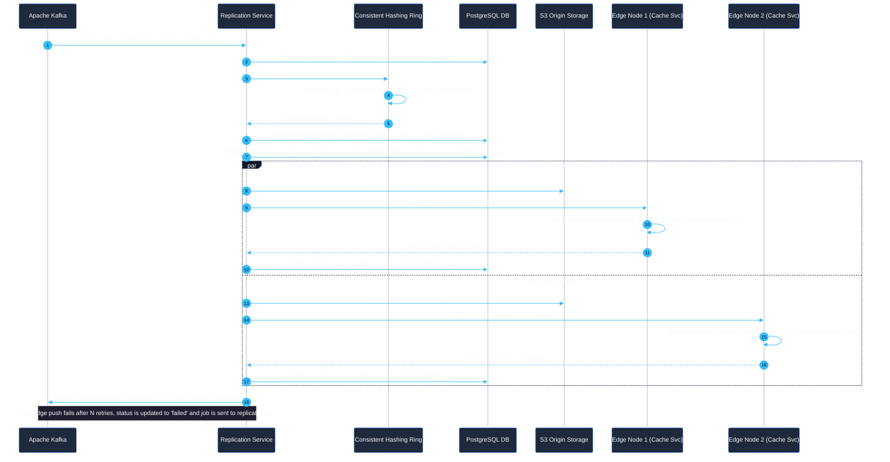

---

## 4. Download Routing with Dynamic Version Resolution & Edge Caching Flow (Phase 2 & 5)

This diagram demonstrates how a client requests a file download, how `DownloadSvc` resolves the active `current_version` via `MetaSvc`, how `RoutingAlgo` selects the best healthy edge node from its internal active set, and how Redis edge caching uses the versioned key (`file:{file_id}:v{version}`).

```mermaid
%%{init: {'theme': 'dark', 'themeVariables': { 'actorBkg': '#1e293b', 'actorBorder': '#3b82f6', 'actorTextColor': '#f8fafc', 'signalColor': '#38bdf8', 'signalTextColor': '#f8fafc', 'labelBoxBkgColor': '#0f172a', 'labelBoxBorderColor': '#334155', 'labelTextColor': '#f8fafc', 'loopTextColor': '#f8fafc', 'noteBkgColor': '#1e1e2e', 'noteTextColor': '#f8fafc'}}}%%
sequenceDiagram
    autonumber
    actor Client
    participant Gateway as Nginx Gateway
    participant DownloadSvc as Download Service
    participant MetaSvc as Metadata Service
    participant RoutingAlgo as CDN Routing Algorithm
    participant EdgeCache as Target Edge Node (Cache Service)
    participant EdgeRedis as Edge Redis Store
    participant S3 as S3 Origin Storage
    participant Kafka as Apache Kafka

    Client->>Gateway: GET /download/{file_id} (Headers: Range, Accept-Encoding)
    Gateway->>DownloadSvc: Route download request
    DownloadSvc->>DownloadSvc: Validate Signed URL token & expiration

    rect rgb(30, 41, 59)
        Note over DownloadSvc, MetaSvc: Version Resolution Step (Prevents stale v1 requests)
        DownloadSvc->>MetaSvc: GET /files/{file_id}/metadata
        MetaSvc-->>DownloadSvc: Return Metadata (current_version = 2, content_type, size)
    end

    DownloadSvc->>RoutingAlgo: SelectBestNode(Client_IP, File_ID) [Consults internal healthy active set]
    RoutingAlgo-->>DownloadSvc: Selects Edge-1 (Region match / Lowest latency)

    DownloadSvc-->>Client: 302 Found (Location: https://edge-1.cdn.net/content/{file_id}?v=2)

    Client->>EdgeCache: GET /content/{file_id}?v=2 (Header: Range: bytes=0-1024)
    EdgeCache->>EdgeRedis: GET file:{file_id}:v2

    alt Cache Hit
        EdgeRedis-->>EdgeCache: Return cached binary content (v2) & metadata
        EdgeCache->>EdgeRedis: ZADD lru_tracking (update access timestamp score)
        EdgeCache->>Kafka: Publish "cache.access" (event_type='hit', file_id, edge_id, bytes_served)
        EdgeCache-->>Client: 206 Partial Content (or 200 OK) + Content-Range
    else Cache Miss
        EdgeRedis-->>EdgeCache: Key Not Found (Cache Miss for v2)
        EdgeCache->>S3: GET /bucket/.../{file_id}/v2/original.ext.gz
        S3-->>EdgeCache: Stream compressed file content (v2)
        EdgeCache->>EdgeCache: Decompress if client does not accept compression
        EdgeCache->>EdgeRedis: SET file:{file_id}:v2 WITH TTL & SADD file:{file_id}:keys file:{file_id}:v2
        EdgeCache->>EdgeRedis: ZADD lru_tracking score file:{file_id}:v2
        EdgeCache->>Kafka: Publish "cache.access" (event_type='miss', file_id, edge_id, bytes_served)
        EdgeCache-->>Client: 206 Partial Content (or 200 OK)
    end
```

---

## 5. Object Versioning & Cluster-Wide Cache Invalidation Sequence (Phase 2 & 3)

This diagram shows what happens when an author updates an existing file. A new version row is added to PostgreSQL, emitting `file.version_created` and `cache.invalidate` events over Kafka to force immediate cache eviction across **all** edge nodes in the cluster, removing keys from Redis and cleaning up `ZREM lru_tracking`.

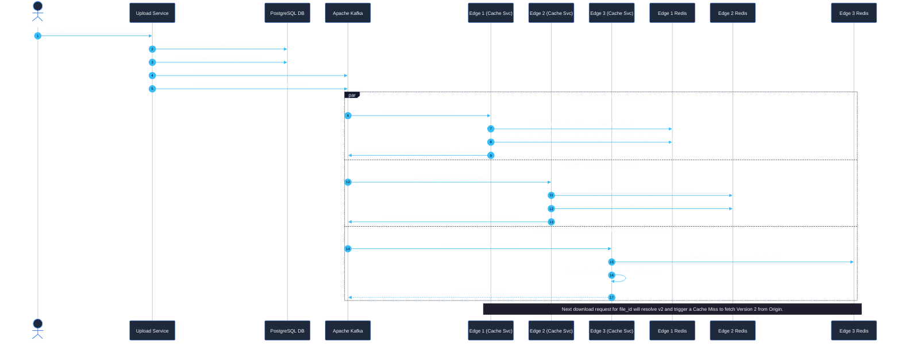

---

## 6. Non-Blocking O(1) Manual CDN Purge API Sequence (Phase 3)

This diagram shows the dedicated `POST /purge` workflow where an admin forces cache invalidation across **all edge nodes** in the cluster using O(1) Redis Set lookups (`file:{file_id}:keys`) and cleans up `ZREM lru_tracking` members to prevent orphan keys in the LRU set.

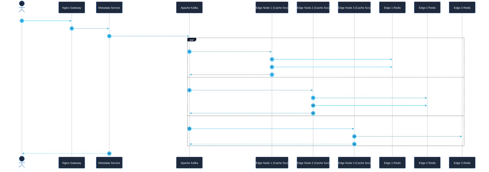

---

## 7. Edge Node Health Check & Automatic Dead-Node Eviction Loop (Phase 4)

This diagram illustrates how the `Health Check Service` monitors 10-second heartbeats using non-blocking Redis `SCAN` operations (avoiding blocking `KEYS` commands in production) and automatically ejects dead or degraded nodes from both the `CDN Routing Algorithm` candidate pool and the `Consistent Hashing Ring`.

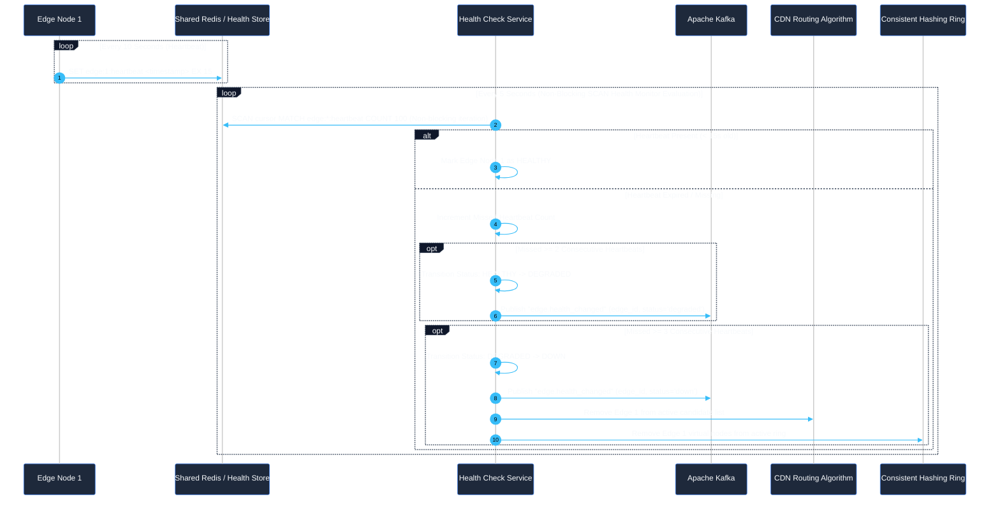

---

## 8. Real-Time Observability & WebSocket Telemetry Stream (Phase 6)

This diagram shows how Kafka event streams (including the `cache.access` topic), PromQL metrics queries, consumer lag, replication state, and download throughput are aggregated by `AnalyticsSvc` and streamed live to the WebSocket Dashboard.

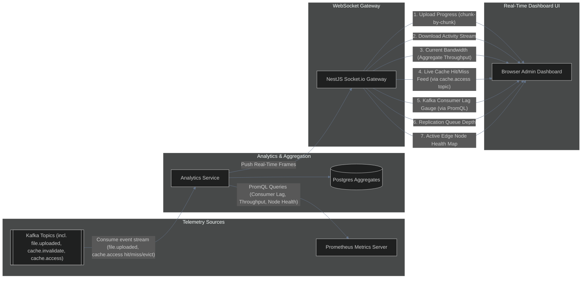

---

## 9. Failure Flow 1: Kafka Event Failure, Exponential Backoff, DLQ & Manual Replay (Phase 7)

This diagram details the fault-tolerance pipeline when a consumer fails to process a Kafka message (e.g. Replication Service network glitch). It shows exponential backoff retries (3 attempts), routing to Dead Letter Queue (`replication.dlq`), alerting, and manual admin replay.

```mermaid
%%{init: {'theme': 'dark', 'themeVariables': { 'actorBkg': '#1e293b', 'actorBorder': '#3b82f6', 'actorTextColor': '#f8fafc', 'signalColor': '#f87171', 'signalTextColor': '#f8fafc', 'labelBoxBkgColor': '#0f172a', 'labelBoxBorderColor': '#ef4444', 'labelTextColor': '#f8fafc', 'loopTextColor': '#f8fafc', 'noteBkgColor': '#2a1215', 'noteTextColor': '#fca5a5'}}}%%
sequenceDiagram
    autonumber
    actor Admin
    participant Kafka as Kafka Main Topic (file.uploaded)
    participant Consumer as Replication Service Consumer
    participant TargetEdge as Edge Node 1
    participant Postgres as PostgreSQL DB
    participant DLQ as Kafka DLQ (file.uploaded.dlq)
    participant AlertSvc as Notification / Alert Service

    Kafka->>Consumer: Poll message "file.uploaded" (event_id: e-101)
    
    rect rgb(45, 20, 25)
        Note over Consumer, TargetEdge: Attempt 1 (Failure)
        Consumer->>TargetEdge: Push content to Edge 1
        TargetEdge--xConsumer: 503 Service Unavailable / Network Timeout
        Consumer->>Consumer: Catch error, log failure
    end

    rect rgb(45, 20, 25)
        Note over Consumer, TargetEdge: Attempt 2 (Exponential Backoff: Wait 2s)
        Consumer->>TargetEdge: Retry Push content to Edge 1
        TargetEdge--xConsumer: 503 Service Unavailable
        Consumer->>Consumer: Catch error, log failure
    end

    rect rgb(45, 20, 25)
        Note over Consumer, TargetEdge: Attempt 3 (Max Retries Reached: Wait 4s)
        Consumer->>TargetEdge: Retry Push content to Edge 1
        TargetEdge--xConsumer: 503 Service Unavailable
    end

    Consumer->>Postgres: UPDATE replication_status SET status='failed', attempts=3
    Consumer->>DLQ: Publish message to "file.uploaded.dlq" with failure_stacktrace
    Consumer-->>Kafka: Commit Offset on Main Topic (Move past unprocessable message)

    DLQ->>AlertSvc: Trigger Alert ("Replication Failure DLQ threshold exceeded")
    AlertSvc-->>Admin: Alert Notification (Slack / PagerDuty / Email)

    rect rgb(30, 41, 59)
        Note over Admin, Consumer: Manual Admin Investigation & Replay
        Admin->>TargetEdge: Fix underlying network / storage issue
        Admin->>DLQ: POST /admin/dlq/replay { "topic": "file.uploaded.dlq", "event_id": "e-101" }
        DLQ->>Kafka: Re-publish message to main topic "file.uploaded"
        Kafka->>Consumer: Poll replayed message
        Consumer->>TargetEdge: Push content payload (Succeeds 200 OK)
        Consumer->>Postgres: UPDATE replication_status SET status='complete'
    end
```

---

## 10. Failure Flow 2: Edge Node Crash, Traffic Failover & Dynamic Replication Repair (Phase 7)

This diagram illustrates what happens when a physical Edge Node crashes: heartbeats stop, the node is marked `DOWN`, the `CDN Routing Algorithm` shifts client download traffic to the next nearest healthy node, and `Replication Service` repairs lost replication factor on the consistent hash ring.

```mermaid
%%{init: {'theme': 'dark', 'themeVariables': { 'actorBkg': '#1e293b', 'actorBorder': '#3b82f6', 'actorTextColor': '#f8fafc', 'signalColor': '#f87171', 'signalTextColor': '#f8fafc', 'labelBoxBkgColor': '#0f172a', 'labelBoxBorderColor': '#ef4444', 'labelTextColor': '#f8fafc', 'loopTextColor': '#f8fafc', 'noteBkgColor': '#2a1215', 'noteTextColor': '#fca5a5'}}}%%
sequenceDiagram
    autonumber
    actor Client
    participant DownloadSvc as Download Service
    participant Edge1 as Edge Node 1 (DEAD)
    participant Edge2 as Edge Node 2 (Healthy)
    participant Edge3 as Edge Node 3 (Healthy Backup)
    participant RedisHB as Shared Redis Health Store
    participant HealthSvc as Health Check Service
    participant RoutingAlgo as CDN Routing Algorithm
    participant HashRing as Consistent Hashing Ring
    participant Kafka as Apache Kafka
    participant ReplSvc as Replication Service

    Note over Edge1: Edge Node 1 Crashes / Power Loss

    loop Every 5 Seconds (Health Check Monitor)
        HealthSvc->>RedisHB: SCAN cursor MATCH edge:*:heartbeat COUNT 100
        RedisHB-->>HealthSvc: Heartbeat for Edge 1 MISSING (Expired)
    end

    HealthSvc->>HealthSvc: Mark Edge Node 1 as DOWN
    
    par Health State Propagation
        HealthSvc->>RoutingAlgo: Remove Edge 1 from Healthy Candidate Set
    and Hash Ring Topology Update
        HealthSvc->>HashRing: Eject Edge 1 Virtual Nodes from Ring
    end

    rect rgb(30, 41, 59)
        Note over Client, Edge2: 1. Traffic Shift (Download Failover)
        Client->>DownloadSvc: GET /download/{file_id}
        DownloadSvc->>RoutingAlgo: SelectBestNode(Client_IP, File_ID)
        RoutingAlgo-->>DownloadSvc: Returns Edge 2 (Next closest healthy node, Edge 1 excluded)
        DownloadSvc-->>Client: 302 Found (Location: https://edge-2.cdn.net/content/{file_id}?v=2)
        Client->>Edge2: GET /content/{file_id}?v=2 (Served without downtime)
    end

    rect rgb(30, 41, 59)
        Note over ReplSvc, Edge3: 2. Dynamic Replication Repair
        HealthSvc->>Kafka: Publish "edge.health_changed" (edge_id=1, status='down')
        Kafka->>ReplSvc: Consume "edge.health_changed" event
        ReplSvc->>HashRing: Re-evaluate placement for files assigned to Edge 1
        HashRing-->>ReplSvc: Target Edges for file_id now [Edge 2, Edge 3]
        ReplSvc->>Edge3: Repair Push: Copy file_id v2 content to Edge 3
        Edge3-->>ReplSvc: 200 OK (Replication Factor = 2 restored across active nodes)
    end
```
