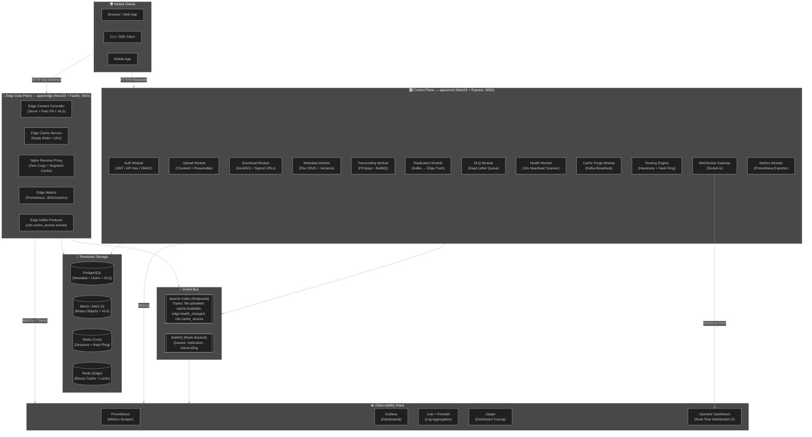
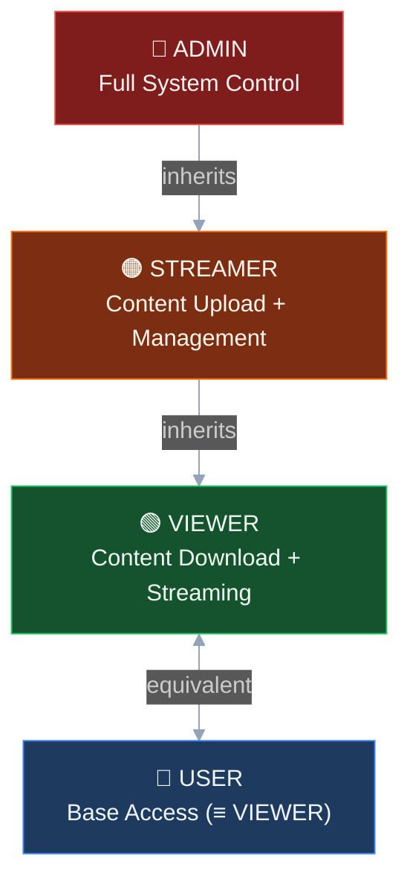
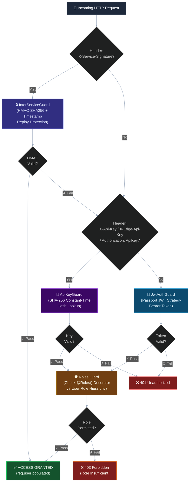
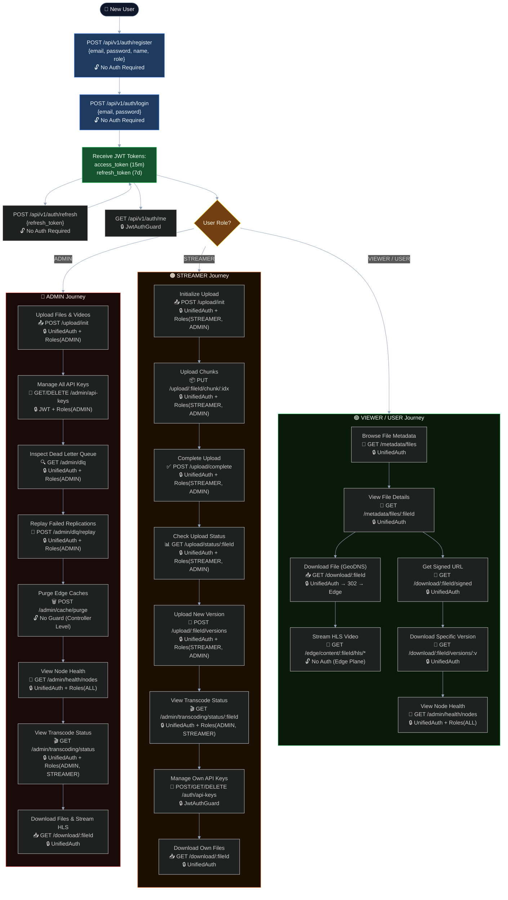
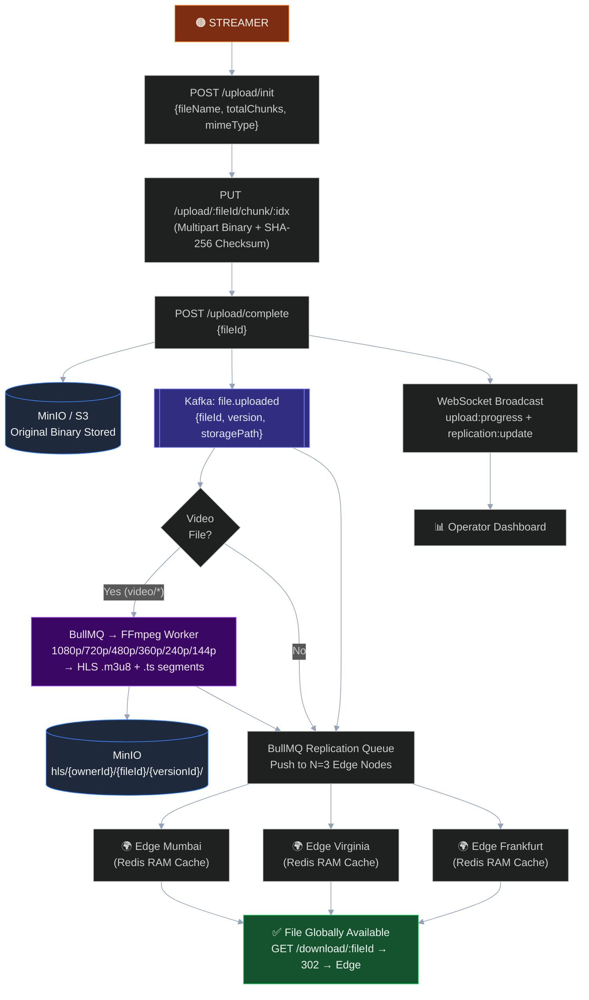
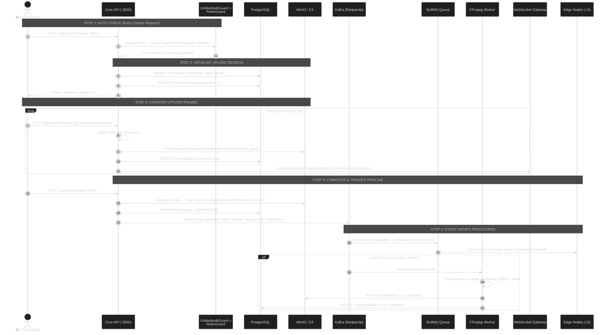
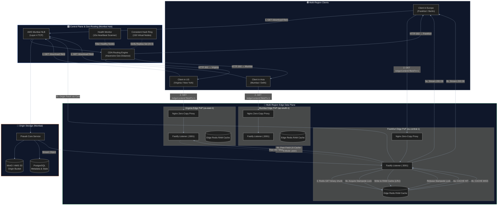
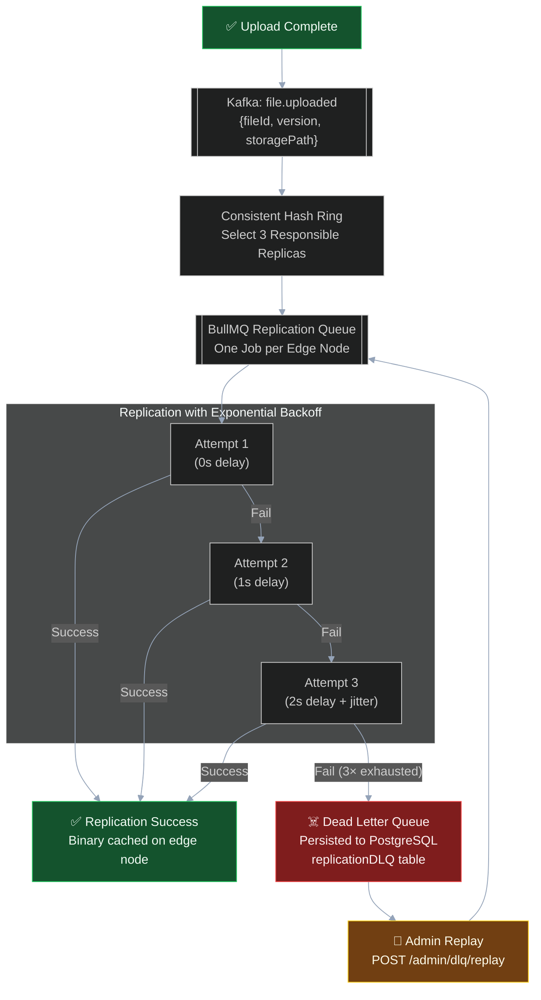
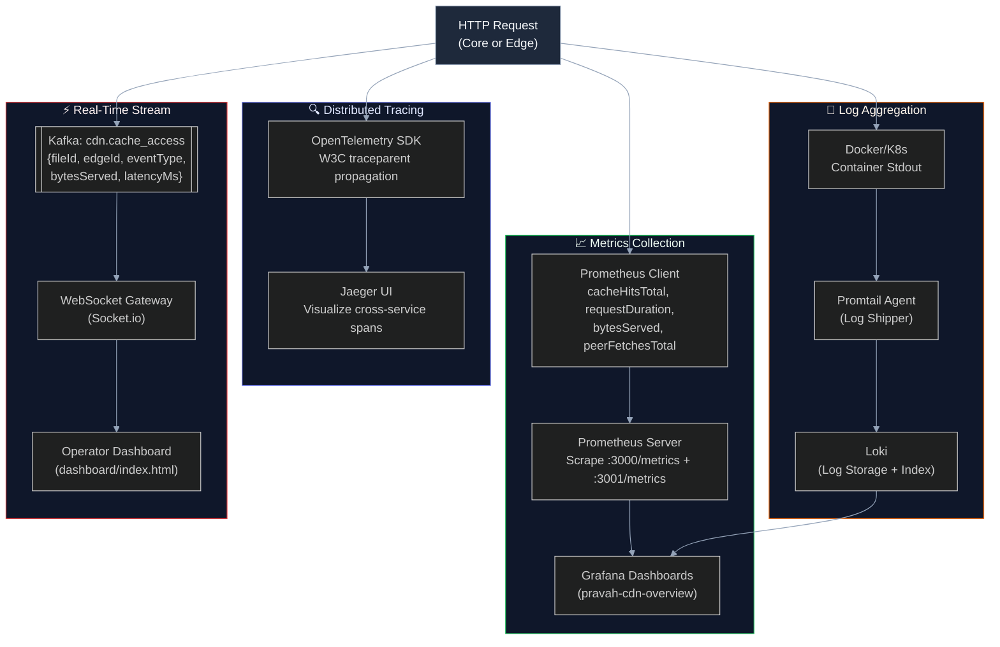

# Pravah Distributed CDN — Architecture 2.0

> **File:** `docs/architecture_2.0.md`
> **Status:** OFFICIAL SYSTEM SPECIFICATION & ARCHITECTURE REFERENCE
> **Version:** 2.0 — Full Architecture, RBAC, User Journeys & Project State
> **Scope:** Complete System Architecture — Authentication, RBAC, Upload/Download Pipelines, Multi-Region Edge Delivery, Transcoding, Replication, Observability, and Infrastructure

---

## Table of Contents

1. [Executive Overview](#1-executive-overview)
2. [System Component Topology](#2-system-component-topology)
3. [Authentication & RBAC Architecture](#3-authentication--rbac-architecture)
4. [User Journey Flows by Role](#4-user-journey-flows-by-role)
5. [Complete API Route Map & Guard Matrix](#5-complete-api-route-map--guard-matrix)
6. [Upload Pipeline — End to End](#6-upload-pipeline--end-to-end)
7. [Download & CDN Delivery Pipeline](#7-download--cdn-delivery-pipeline)
8. [Multi-Region Edge Data Plane](#8-multi-region-edge-data-plane)
9. [Adaptive Bitrate Transcoding Pipeline](#9-adaptive-bitrate-transcoding-pipeline)
10. [Replication, DLQ & Self-Healing](#10-replication-dlq--self-healing)
11. [Telemetry, Event Bus & Observability](#11-telemetry-event-bus--observability)
12. [Infrastructure & Deployment](#12-infrastructure--deployment)
13. [Current Project State](#13-current-project-state)

---

## 1. Executive Overview

**Pravah** is a production-grade, multi-region distributed Content Delivery Network (CDN) built from scratch with **NestJS**, **Fastify**, **Redis**, **PostgreSQL**, **MinIO/S3**, **Apache Kafka (Redpanda)**, **Nginx**, and **Kubernetes**. It delivers files and adaptive bitrate video streams to clients worldwide with sub-millisecond edge cache latencies.

### Core Capabilities

| Capability | Implementation |
| :--- | :--- |
| **Resumable Chunked Uploads** | SHA-256 verified, multipart with auto-retry |
| **Adaptive Bitrate Streaming** | FFmpeg → HLS (1080p/720p/480p/360p/240p/144p) |
| **GeoDNS Routing** | Haversine distance + health-aware HTTP 302 redirects |
| **Tiered Edge Caching** | Local RAM → Peer Edge → Origin S3 with stampede locks |
| **Zero-Copy Proxy** | Nginx `sendfile` + segment/manifest cache zones |
| **RBAC + Multi-Auth** | JWT + API Key + HMAC Inter-Service with role hierarchy |
| **Event-Driven Replication** | Kafka → BullMQ with exponential backoff + DLQ |
| **Full Observability Stack** | Prometheus + Grafana + Loki + Jaeger + WebSocket Dashboard |
| **Kubernetes Orchestration** | Helm charts, HPA, multi-region EKS deployment |
| **Consistent Hashing** | 150 virtual nodes per edge, $N=3$ replication factor |

---

## 2. System Component Topology



---

## 3. Authentication & RBAC Architecture

### 3.1 Role Definitions

Pravah uses four distinct roles defined in the Prisma schema:

| Role | Purpose | Inherits From |
| :--- | :--- | :--- |
| **`ADMIN`** | Full system control — DLQ, cache purge, transcoding, user management, API key management | STREAMER, VIEWER, USER |
| **`STREAMER`** | Content creator — upload files/videos, view transcoding status, manage own API keys | VIEWER, USER |
| **`VIEWER`** | Content consumer — download files, stream HLS video, view metadata | USER |
| **`USER`** | Base role — same as VIEWER (download + metadata access) | — |

### 3.2 Role Hierarchy (`RolesGuard`)

The `RolesGuard` implements a hierarchical permission model where higher roles inherit all permissions of lower roles:

```
ADMIN ⊃ STREAMER ⊃ VIEWER ≡ USER
```



### 3.3 Guard Chain Architecture

The `UnifiedAuthGuard` implements a cascading authentication strategy. Each incoming request is evaluated through this chain:



### 3.4 Guard Files Reference

| Guard | File | Purpose |
| :--- | :--- | :--- |
| `UnifiedAuthGuard` | `apps/core/src/auth/guards/unified-auth.guard.ts` | Cascading auth chain (ISG → API Key → JWT) |
| `RolesGuard` | `apps/core/src/auth/guards/roles.guard.ts` | Hierarchical role permission check via `@Roles()` decorator |
| `JwtAuthGuard` | `apps/core/src/auth/guards/jwt-auth.guard.ts` | Passport JWT strategy — validates Bearer tokens |
| `ApiKeyGuard` | `apps/core/src/auth/guards/api-key.guard.ts` | SHA-256 constant-time API key hash lookup |
| `InterServiceGuard` | `apps/core/src/auth/guards/inter-service.guard.ts` | HMAC-SHA256 signature + timestamp replay protection |

---

## 4. User Journey Flows by Role

### 4.1 Complete User Lifecycle — All Roles



### 4.2 STREAMER Upload-to-Delivery Pipeline

This diagram traces a STREAMER's file from upload to global edge delivery:



---

## 5. Complete API Route Map & Guard Matrix

### 5.1 Authentication Routes (`/api/v1/auth`)

| Method | Route | Guard(s) | Roles | Description |
| :--- | :--- | :--- | :--- | :--- |
| `POST` | `/auth/register` | None | Public | Create new account |
| `POST` | `/auth/login` | None | Public | Get JWT access + refresh tokens |
| `POST` | `/auth/refresh` | None | Public | Refresh expired access token |
| `GET` | `/auth/me` | `JwtAuthGuard` | Any authenticated | Get current user profile |

### 5.2 API Key Management (`/api/v1/auth/api-keys`)

| Method | Route | Guard(s) | Roles | Description |
| :--- | :--- | :--- | :--- | :--- |
| `POST` | `/auth/api-keys` | `JwtAuthGuard` | Any authenticated | Create personal API key |
| `GET` | `/auth/api-keys` | `JwtAuthGuard` | Any authenticated | List own API keys |
| `DELETE` | `/auth/api-keys/:id` | `JwtAuthGuard` | Any authenticated | Revoke own API key |

### 5.3 Admin API Key Management (`/api/v1/admin/api-keys`)

| Method | Route | Guard(s) | Roles | Description |
| :--- | :--- | :--- | :--- | :--- |
| `GET` | `/admin/api-keys` | `JwtAuthGuard` + `RolesGuard` | **ADMIN** | List all API keys in system |
| `DELETE` | `/admin/api-keys/:id` | `JwtAuthGuard` + `RolesGuard` | **ADMIN** | Revoke any API key |

### 5.4 Upload Routes (`/api/v1/upload`)

| Method | Route | Guard(s) | Roles | Description |
| :--- | :--- | :--- | :--- | :--- |
| `POST` | `/upload/init` | `UnifiedAuthGuard` + `RolesGuard` | **STREAMER, ADMIN** | Initialize upload session |
| `POST` | `/upload/:fileId/versions` | `UnifiedAuthGuard` + `RolesGuard` | **STREAMER, ADMIN** | Create new version of existing file |
| `PUT` | `/upload/:fileId/chunk/:idx` | `UnifiedAuthGuard` + `RolesGuard` | **STREAMER, ADMIN** | Upload binary chunk with checksum |
| `GET` | `/upload/status/:fileId` | `UnifiedAuthGuard` + `RolesGuard` | **STREAMER, ADMIN** | Check upload progress |
| `POST` | `/upload/complete` | `UnifiedAuthGuard` + `RolesGuard` | **STREAMER, ADMIN** | Finalize upload, trigger events |

### 5.5 Metadata Routes (`/api/v1/metadata`)

| Method | Route | Guard(s) | Roles | Description |
| :--- | :--- | :--- | :--- | :--- |
| `GET` | `/metadata/files` | `UnifiedAuthGuard` | Any authenticated | List user's files (paginated) |
| `GET` | `/metadata/files/:fileId` | `UnifiedAuthGuard` | Any authenticated | Get file details + versions |
| `GET` | `/metadata/files/:fileId/versions` | `UnifiedAuthGuard` | Any authenticated | List all versions of a file |
| `DELETE` | `/metadata/files/:fileId` | `UnifiedAuthGuard` | Any authenticated | Delete a file (owner only) |

### 5.6 Download Routes (`/api/v1/download`)

| Method | Route | Guard(s) | Roles | Description |
| :--- | :--- | :--- | :--- | :--- |
| `GET` | `/download/:fileId` | `UnifiedAuthGuard` | Any authenticated | GeoDNS redirect → nearest edge (302) |
| `GET` | `/download/:fileId/signed` | `UnifiedAuthGuard` | Any authenticated | Get time-limited signed URL |
| `GET` | `/download/:fileId/versions/:v` | `UnifiedAuthGuard` | Any authenticated | Download specific version via edge |

### 5.7 Admin Health Routes (`/api/v1/admin/health`)

| Method | Route | Guard(s) | Roles | Description |
| :--- | :--- | :--- | :--- | :--- |
| `POST` | `/admin/health/heartbeat` | **None** | Public (Edge nodes) | Edge node heartbeat (HMAC-signed by edge) |
| `GET` | `/admin/health/nodes` | `UnifiedAuthGuard` + `RolesGuard` | **ADMIN, STREAMER, USER** | List all nodes with health status |
| `GET` | `/admin/health/nodes/healthy` | `UnifiedAuthGuard` + `RolesGuard` | **ADMIN, STREAMER, USER** | List only healthy nodes |

### 5.8 Admin Cache Purge (`/api/v1/admin/cache`)

| Method | Route | Guard(s) | Roles | Description |
| :--- | :--- | :--- | :--- | :--- |
| `POST` | `/admin/cache/purge` | **None** (Controller level) | Open | Broadcast Kafka `cache.invalidate` event |

### 5.9 Admin DLQ Routes (`/api/v1/admin/dlq`)

| Method | Route | Guard(s) | Roles | Description |
| :--- | :--- | :--- | :--- | :--- |
| `GET` | `/admin/dlq` | `UnifiedAuthGuard` + `RolesGuard` | **ADMIN** | List all dead-lettered replications |
| `GET` | `/admin/dlq/:id` | `UnifiedAuthGuard` + `RolesGuard` | **ADMIN** | Get specific DLQ event details |
| `POST` | `/admin/dlq/replay` | `UnifiedAuthGuard` + `RolesGuard` | **ADMIN** | Replay single DLQ event |
| `POST` | `/admin/dlq/replay-all` | `UnifiedAuthGuard` + `RolesGuard` | **ADMIN** | Replay all DLQ events |
| `DELETE` | `/admin/dlq/:id` | `UnifiedAuthGuard` + `RolesGuard` | **ADMIN** | Purge DLQ event |

### 5.10 Admin Transcoding (`/api/v1/admin/transcoding`)

| Method | Route | Guard(s) | Roles | Description |
| :--- | :--- | :--- | :--- | :--- |
| `GET` | `/admin/transcoding/status/:fileId` | `UnifiedAuthGuard` + `RolesGuard` | **ADMIN, STREAMER** | Get transcoding status for file |
| `GET` | `/admin/transcoding/status/:fileId/version/:vId` | `UnifiedAuthGuard` + `RolesGuard` | **ADMIN, STREAMER** | Get transcoding status for specific version |

### 5.11 Internal Routes (No Auth — Inter-Service)

| Method | Route | Guard(s) | Roles | Description |
| :--- | :--- | :--- | :--- | :--- |
| `GET` | `/internal/metadata/files/:fileId/versions/:v` | **None** | Internal | Version metadata lookup (Edge → Core) |
| `GET` | `/internal/metadata/files/:fileId` | **None** | Internal | File metadata lookup (Edge → Core) |
| `GET` | `/internal/placement/:fileId/v/:v` | **None** | Internal | Placement + replica lookup (Edge → Core) |

### 5.12 Edge Data Plane Routes (No Auth — Edge Nodes)

| Method | Route | Guard(s) | Roles | Description |
| :--- | :--- | :--- | :--- | :--- |
| `GET` | `/edge/content/:fileId` | **None** | Public (via 302 redirect) | Serve file from edge cache |
| `GET` | `/edge/content/:fileId/hls/*` | **None** | Public | Stream HLS manifest/segments |
| `POST` | `/edge/content/:fileId/purge` | **None** | Internal | Purge file from local edge cache |

---

## 6. Upload Pipeline — End to End

### Upload Sequence Diagram



---

## 7. Download & CDN Delivery Pipeline

### Multi-Region GeoDNS Request Flow



### Cache HIT vs MISS — Summary Matrix

| Metric | Cache HIT Path | Cache MISS Path |
| :--- | :--- | :--- |
| **Typical Latency** | **0.8ms – 2.5ms** | **45ms – 180ms** (Origin round-trip) |
| **Network Path** | Client ↔ Local Edge Redis RAM | Client → Edge → [Peer Edge] → Core → S3 |
| **I/O Operations** | 1 Redis Memory Read | 1 Stampede Lock + 1 S3 Stream + 1 Redis Write |
| **CPU Impact** | Ultra-low (zero-copy buffer) | Moderate (HTTP piping, lock mutex) |
| **Headers Returned** | `X-Cache: HIT` | `X-Cache: MISS` or `X-Cache: PEER_HIT` |
| **Telemetry** | `hit: true, source: "ram_cache"` | `hit: false, source: "origin"` |

---

## 8. Multi-Region Edge Data Plane

### 8.1 Edge Node Architecture

Each edge PoP consists of three layers:

```
┌─────────────────────────────────────────────────┐
│              EDGE POINT OF PRESENCE              │
├─────────────────────────────────────────────────┤
│  Layer 1: Nginx Reverse Proxy (Zero-Copy)       │
│  ├── Segment Cache Zone (20GB disk, .ts/.m4s)   │
│  ├── Manifest Microcache (1s TTL, .m3u8)        │
│  ├── sendfile on; tcp_nopush on; tcp_nodelay on  │
│  └── Upstream Keep-Alive Pool → Fastify :3001   │
├─────────────────────────────────────────────────┤
│  Layer 2: Fastify Application (NestJS Edge)     │
│  ├── EdgeContentController (Serve + Peer Fill)  │
│  ├── MetricsService (Prometheus counters)       │
│  ├── KafkaService (cdn.cache_access producer)   │
│  └── OpenTelemetry tracer (W3C traceparent)     │
├─────────────────────────────────────────────────┤
│  Layer 3: Redis RAM Cache                       │
│  ├── binary:{fileId}:v{ver}:{chunk} → Buffer    │
│  ├── meta:{fileId}:v{ver} → {etag, contentType} │
│  ├── lock:stampede:{fileId}:v{ver} → UUID mutex │
│  └── maxmemory-policy: allkeys-lru              │
└─────────────────────────────────────────────────┘
```

### 8.2 Stampede Protection

When 1,000 concurrent clients request the same uncached file:
- **Only 1 request** acquires the distributed lock (`SET NX PX 5000`)
- **999 requests** sleep 500ms, then resolve from the newly populated cache
- **Result**: 1 origin fetch instead of 1,000 — prevents origin collapse

### 8.3 Tiered Cache Fill Strategy

```
Priority 1: Local Edge Redis RAM Cache (< 1ms)
    ↓ MISS
Priority 2: Peer Edge Node via VPC (X-Cache-Fill-Mode: peer)
    ↓ MISS (404)
Priority 3: Core Origin MinIO/S3 via NLB (45-180ms)
```

---

## 9. Adaptive Bitrate Transcoding Pipeline

When a `video/*` file is uploaded, the transcoding pipeline produces HLS adaptive bitrate streams:

```
Input: Raw video file (e.g., 4K .mp4)
    │
    ▼
┌─────────────────────────────────────────────────────┐
│ FFmpeg Transcoding Pipeline (BullMQ Background Job) │
├─────────────────────────────────────────────────────┤
│                                                     │
│   Input ──► 1080p (5000 kbps) ──► segment_000.ts   │
│         ──► 720p  (2800 kbps) ──► segment_000.ts   │
│         ──► 480p  (1400 kbps) ──► segment_000.ts   │
│         ──► 360p  (800 kbps)  ──► segment_000.ts   │
│         ──► 240p  (400 kbps)  ──► segment_000.ts   │
│         ──► 144p  (200 kbps)  ──► segment_000.ts   │
│                                                     │
│   + master.m3u8 (Adaptive Playlist)                 │
│   + {resolution}/playlist.m3u8 (Per-Rendition)      │
│                                                     │
└─────────────────────────────────────────────────────┘
    │
    ▼
Storage: MinIO at hls/{ownerId}/{fileId}/{versionId}/
    │
    ▼
Edge Delivery: GET /edge/content/:fileId/hls/master.m3u8
               GET /edge/content/:fileId/hls/720p/segment_001.ts
```

---

## 10. Replication, DLQ & Self-Healing

### 10.1 Replication Flow



### 10.2 Edge Node Crash & Self-Healing Timeline

```
T = 0s                T = 10s              T = 15s                T = 16s
┌──────────────┐     ┌──────────────┐     ┌─────────────────┐   ┌────────────────┐
│ Frankfurt    │     │ Core Heartbeat│    │ Consistent Ring │   │ EU Clients     │
│ Node Crashes ├────►│ Monitor Misses├───► Ejects 150      ├──►│ 302 Redirect   │
│              │     │ Scan (×1)    │     │ Virtual Keys    │   │ to Virginia    │
└──────────────┘     └──────────────┘     └─────────────────┘   └────────────────┘
```

**Impact**: Only ~33% of cached keys are remapped ($1/N$ consistent hashing property). The remaining 67% of files continue serving from their original edge nodes uninterrupted.

---

## 11. Telemetry, Event Bus & Observability

### 11.1 Four-Layer Observability Pipeline



### 11.2 Prometheus Metrics Exported

| Metric Name | Type | Labels | Source |
| :--- | :--- | :--- | :--- |
| `pravah_edge_cache_hits_total` | Counter | — | Edge |
| `pravah_edge_cache_misses_total` | Counter | — | Edge |
| `pravah_edge_bytes_served_total` | Counter | `source` | Edge |
| `pravah_edge_request_duration_seconds` | Histogram | `cache_result`, `status_code` | Edge |
| `pravah_edge_peer_fetches_total` | Counter | `peer_id`, `status` | Edge |
| `pravah_core_http_requests_total` | Counter | `method`, `route`, `status_code` | Core |
| `pravah_core_http_request_duration_seconds` | Histogram | `method`, `route` | Core |
| `pravah_core_cache_invalidations_total` | Counter | — | Core |
| `pravah_core_dlq_active_items` | Gauge | — | Core |

### 11.3 WebSocket Events

| Event Name | Direction | Payload | Description |
| :--- | :--- | :--- | :--- |
| `metrics:update` | Server → Client | `{hitRatio, bandwidth, totalRequests}` | Live CDN performance metrics |
| `upload:progress` | Server → Client | `{fileId, chunkIndex, percentage}` | Upload chunk progress |
| `replication:update` | Server → Client | `{fileId, edgeId, status}` | Replication job status |
| `cache:invalidated` | Server → Client | `{fileId, reason, timestamp}` | Cache purge notification |
| `node:health` | Server → Client | `{edgeId, status, lastHeartbeat}` | Node health change |

---

## 12. Infrastructure & Deployment

### 12.1 Repository Structure

```
pravah/
├── apps/
│   ├── core/                    # Control Plane (NestJS + Express :3000)
│   │   ├── src/
│   │   │   ├── auth/            # JWT, API Key, Guards, Roles
│   │   │   ├── upload/          # Chunked upload pipeline
│   │   │   ├── download/        # GeoDNS routing + signed URLs
│   │   │   ├── metadata/        # File & version CRUD
│   │   │   ├── transcoding/     # FFmpeg HLS pipeline
│   │   │   ├── replication/     # Kafka → BullMQ → Edge push + DLQ
│   │   │   ├── telemetry/       # WebSocket gateway (Socket.io)
│   │   │   ├── metrics/         # Prometheus exporter + HTTP interceptor
│   │   │   └── common/          # Kafka, routing, health, edge-cache
│   │   └── prisma/              # PostgreSQL schema + seed
│   └── edge/                    # Data Plane (NestJS + Fastify :3001)
│       └── src/
│           ├── content/         # Edge content delivery + HLS + peer fill
│           ├── cache/           # Redis RAM cache service
│           ├── minio/           # MinIO/S3 object streaming
│           ├── metrics/         # Prometheus counters + histograms
│           └── kafka/           # Event producer (cdn.cache_access)
├── dashboard/                   # Real-time operator web UI (HTML/JS)
├── infra/
│   ├── docker/                  # Docker Compose (core + edge clusters)
│   ├── nginx/                   # Zero-copy reverse proxy configs
│   ├── terraform/               # AWS multi-region IaC
│   └── k8s/                     # Kubernetes manifests (16 files)
├── observability/
│   ├── prometheus.yml           # Scrape config (Core + Edge targets)
│   ├── promtail-config.yml      # Log shipper rules
│   └── grafana/                 # Dashboard JSON + provisioning
├── benchmarks/                  # k6 load test scripts
├── docs/                        # Architecture specs & reports
└── scripts/                     # Utility scripts
```

### 12.2 Docker Compose Services

**Core Stack** (`infra/docker/docker-compose.core.yml`):
- `core-app` — NestJS Control Plane
- `postgres` — PostgreSQL 16
- `redis` — Redis 7 (Core)
- `minio` — MinIO S3-compatible storage
- `redpanda` — Kafka-compatible event bus
- `jaeger` — Distributed tracing UI

**Edge Stack** (`infra/docker/docker-compose.edge.yml`):
- `edge-app` — Mumbai edge node (:3001)
- `edge-node-02` — Virginia edge node (:4001, simulated)
- `edge-node-03` — Frankfurt edge node (:5001, simulated)
- `edge-redis` — Redis 7 (Edge RAM cache)
- `edge-proxy` — Nginx reverse proxy

**Observability Stack** (`docker-compose.yml`):
- `prometheus` — Metrics scraper
- `grafana` — Dashboard UI
- `loki` — Log storage
- `promtail` — Log shipper

### 12.3 Kubernetes Deployment

16 Kubernetes manifests in `infra/k8s/` define:
- Namespace, ConfigMaps, Secrets
- Core Deployment + Service + HPA
- Edge Deployment + Service + HPA (with Nginx sidecar)
- Spoke Edge Deployment (multi-region)
- Ingress routing rules

---

## 13. Current Project State

### Completed Phases

| Phase | Name | Status | Key Deliverables |
| :--- | :--- | :--- | :--- |
| **0–4** | Core Foundation & Event Broker | ✅ Complete | Chunked uploads, checksums, MinIO, Redis cache, versioning, Kafka, health monitor |
| **5** | Microservices Split & Consistent Hashing | ✅ Complete | `apps/core` + `apps/edge` separation, 150-vnode hash ring, GeoDNS (Haversine), dynamic rebalancing |
| **6** | Multi-Region & Full Observability | ✅ Complete | Prometheus, Grafana, Loki, Jaeger (OpenTelemetry), WebSocket gateway, real-time dashboard |
| **7** | System Hardening & Fault Tolerance | ✅ Complete | 3× exponential backoff, DLQ (Kafka + PostgreSQL), admin DLQ APIs, edge crash failover, hash ring self-healing, k6 benchmarks |
| **8A** | Adaptive Bitrate Transcoding | ✅ Complete | FFmpeg BullMQ pipeline, 6-rendition HLS (1080p→144p), `.m3u8` + `.ts` packaging, edge HLS caching |
| **8B** | Kubernetes (EKS) Orchestration | ✅ Complete | 16 K8s manifests, Helm, HPA auto-scaling, 100K RPS EKS stress test (1.77ms P50 latency) |
| **8C** | Security Hardening & RBAC | ✅ Complete | `UnifiedAuthGuard` chain, `RolesGuard` hierarchy, `ApiKeyGuard` (SHA-256), `InterServiceGuard` (HMAC-SHA256), per-version stampede locks |
| **9** | Zero-Copy Reverse Proxy | ✅ Complete | Nginx `sendfile`, 20GB segment cache, 1s manifest microcache, upstream keep-alive, Alpine Docker, CI/CD matrix, K8s sidecar |

### Architecture Metrics

| Metric | Value |
| :--- | :--- |
| **Total Source Files** | ~120+ TypeScript files across core + edge |
| **Kubernetes Manifests** | 16 YAML files |
| **Prometheus Metrics** | 9 custom metrics (counters, histograms, gauges) |
| **Kafka Topics** | 4 (`file.uploaded`, `cache.invalidate`, `edge.health_changed`, `cdn.cache_access`) |
| **WebSocket Events** | 5 real-time event types |
| **API Routes** | 35+ REST endpoints across core + edge |
| **Auth Guards** | 5 guard classes with 3-tier cascading chain |
| **User Roles** | 4 (`ADMIN`, `STREAMER`, `VIEWER`, `USER`) with hierarchy |
| **Edge Regions** | 3 (Mumbai, Virginia, Frankfurt) |
| **Cache Fill Tiers** | 3 (Local RAM → Peer Edge → Origin S3) |
| **HLS Renditions** | 6 (1080p / 720p / 480p / 360p / 240p / 144p) |
| **Benchmark Result** | 100K RPS on EKS with 1.77ms P50 latency |

### Target: 1,000,000 RPS Architecture

```
                    1,000,000 Requests / Second (1M RPS)
                                   │
            ┌──────────────────────┴──────────────────────┐
      Global Anycast DNS / BGP Routing (Multi-Region)
            │                      │                      │
     [Region 1: Mumbai]     [Region 2: Frankfurt]   [Region 3: Virginia]
       (250,000 RPS)          (250,000 RPS)          (500,000 RPS)
            │                      │                      │
     K8s Cluster             K8s Cluster            K8s Cluster
   (50 Edge Pods)          (50 Edge Pods)        (100 Edge Pods)
            │                      │                      │
  Nginx Zero-Copy Cache  Nginx Zero-Copy Cache  Nginx Zero-Copy Cache
```

With zero-copy reverse proxy caching, only **20–40 high-performance edge servers** are required worldwide to sustain 1M RPS, achieving $99.5\%+$ edge cache hit ratio.
