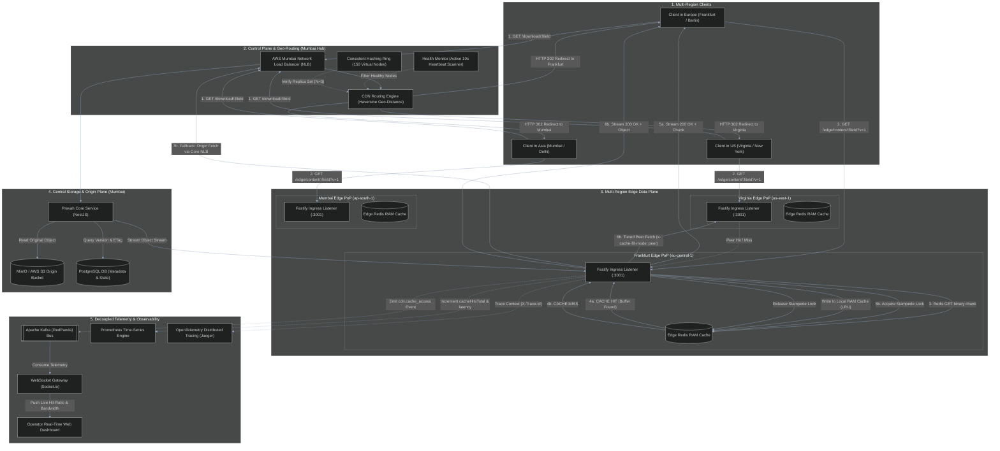
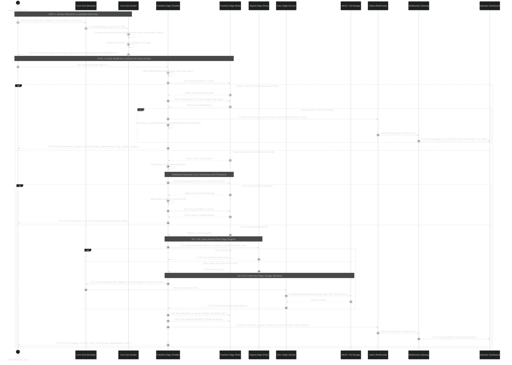

# Pravah Distributed CDN — Complete HTTP Download Request Flow & Architecture Specification

> **File:** `docs/architecture_2.0.md`  
> **Status:** OFFICIAL SYSTEM SPECIFICATION & ARCHITECTURE REFERENCE  
> **Scope:** Multi-Region Ingress, Geo-Routing, Edge Cache Hits/Misses, Tiered Peer Fills, Kafka Event Streaming, WebSockets, and Observability  
> 🔗 **System Topology & Roadmap:** For the high-level microservices topology, sequence diagrams, and evolutionary roadmap, see [**`architecture.md`**](architecture.md).

---

## 1. Executive Overview

This document specifies the end-to-end lifecycle of an HTTP file download request (`GET /download/:fileId` or `GET /edge/content/:fileId`) across the **Pravah Distributed CDN**. 

It traces the request through every component of the architecture, including:
1. **Multi-Region GeoDNS & Client Ingress**: How clients in **Europe (Frankfurt)**, the **Americas (N. Virginia)**, and **Asia (Mumbai)** are routed to the optimal Edge Point of Presence (PoP).
2. **The Ultra-Fast Cache HIT Path**: Sub-millisecond binary retrieval from local Edge Redis RAM.
3. **The Cache MISS & Tiered Cache Fill Path**: Distributed stampede lock protection, peer-to-peer edge fetch, and Origin S3/MinIO streaming.
4. **Fault Tolerance & Dynamic Failover**: Automated rerouting when an edge node crashes or misses its 10-second heartbeat.
5. **Decoupled Telemetry & Observability**: OpenTelemetry distributed tracing, Prometheus metrics collection, Kafka event streaming, and real-time WebSocket dashboard broadcasts.

---

## 2. High-Level Multi-Region Request Flowchart

The following flowchart illustrates the complete decision tree from client DNS resolution to byte delivery:



---

## 3. End-to-End Sequence Diagram

The following sequence diagram details the exact message interactions, headers, cryptographic tokens, distributed locks, and telemetry events during both a **Cache HIT** and a **Cache MISS**:



---

## 4. Architectural Deep-Dive by Component

### 1. Ingress & Routing Plane
* **AWS Network Load Balancer (NLB)**:
  - Operates at **Layer 4 (TCP)** in the Mumbai central region.
  - Distributes ingress traffic across active Core replicas without decrypting or re-wrapping packets.
  - Bridges public internet clients to private Kubernetes worker node subnets.
* **CDN Geo-Routing Algorithm (`cdnRouter`)**:
  - Extracts client IP from `X-Forwarded-For` or socket address.
  - Resolves client geolocation (Latitude / Longitude).
  - Evaluates distance to all active edge nodes using the **Spherical Haversine Formula**:
    $$d = 2R \arcsin \left( \sqrt{\sin^2\left(\frac{\Delta \phi}{2}\right) + \cos(\phi_1)\cos(\phi_2)\sin^2\left(\frac{\Delta \lambda}{2}\right)} \right)$$
  - Filters candidate list against the **Health Monitor**: nodes marked `DEGRADED` or `DOWN` are excluded.
  - Returns an **HTTP 302 Found** redirect pointing the client directly to the chosen edge PoP's Fastify port (`3001`).

---

### 2. Multi-Region Edge Data Plane (`apps/edge`)
* **Fastify Ingress Engine**:
  - Binds to `0.0.0.0:3001` with `keepAliveTimeout: 65000`.
  - Configured for high-throughput stream piping (`res.status(200).end(buffer)`), avoiding V8 buffer copies.
* **Local Redis RAM Cache**:
  - Stores binary chunks under `binary:{fileId}:v{version}:{chunkIndex}`.
  - Enforces `maxmemory-policy: allkeys-lru` — least recently accessed files are evicted when RAM pressure rises.
* **Stampede Protection Mutex**:
  - Implements a distributed lock (`SET lock:stampede:{fileId}:v{version} {uuid} NX PX 5000`).
  - When 1,000 clients simultaneously request an uncached file, **only 1 request acquires the lock** to populate the cache. The remaining 999 requests sleep for 500ms and resolve directly from the newly populated RAM cache, preventing origin collapse.
* **Tiered Cache Fill (`X-Cache-Fill-Mode`)**:
  - **Peer Mode**: Edge nodes query neighboring edges over cloud VPC peer connections before escalating to the Origin.
  - **Origin Mode**: Fallback to Mumbai central MinIO/S3 origin storage.

---

### 3. Fault Tolerance & Self-Healing (Edge Node Crash Scenario)
What happens if an edge node (e.g., Frankfurt) suffers a catastrophic hardware failure?

```
┌────────────────────────────────────────────────────────────────────────────────────────┐
│                          DYNAMIC EDGE CRASH RECOVERY TIMELINE                          │
│                                                                                        │
│   T = 0s               T = 10s              T = 15s                 T = 16s            │
│  ┌──────────────┐     ┌──────────────┐     ┌─────────────────┐     ┌────────────────┐  │
│  │ Frankfurt    │     │ Core Heartbeat│    │ Consistent Ring │     │ Incoming EU    │  │
│  │ Node Crashes ├────►│ Monitor Misses├────► Ejects Dead     ├────►│ Clients 302 to │  │
│  │ Hardware Halt│     │ Scan (x1)    │     │ 150 Virtual Keys│     │ Next Nearest   │  │
│  └──────────────┘     └──────────────┘     └─────────────────┘     │ (Mumbai/VA)    │  │
│                                                                    └────────────────┘  │
└────────────────────────────────────────────────────────────────────────────────────────┘
```

1. **Heartbeat Loss**: Frankfurt edge stops transmitting HMAC-SHA256 heartbeats to Mumbai Core NLB.
2. **Dead-Node Detection**: Core `HealthScanner` detects Frankfurt has missed its 10-second interval; updates PostgreSQL and Redis node state to `DOWN`.
3. **Consistent Hash Ring Rebalance**: The Consistent Hashing Ring ejects Frankfurt’s 150 virtual node keys. In accordance with consistent hashing theory:
   $$\text{Keys Remapped} \approx \frac{1}{N} = \frac{1}{3} \approx 33.3\%$$
   The remaining $66.7\%$ of cached files remain unaffected.
4. **Traffic Rerouting**: Future requests from European clients are automatically redirected to the next nearest healthy PoP (e.g., Virginia or Mumbai) with zero 500 errors.

---

### 4. Telemetry, Event Bus & Observability Pipeline

Every request is observed through four coordinated telemetry layers:

```
                          REQUEST EXECUTION ON EDGE
                                     │
         ┌───────────────────────────┼───────────────────────────┐
         │                           │                           │
         ▼                           ▼                           ▼
 ┌───────────────┐           ┌───────────────┐           ┌───────────────┐
 │ OpenTelemetry │           │  Prometheus   │           │ Apache Kafka  │
 │ (Tracing)     │           │   (Metrics)   │           │ (Event Bus)   │
 └───────┬───────┘           └───────┬───────┘           └───────┬───────┘
         │                           │                           │
         ▼                           ▼                           ▼
  Trace Context               Histogram Bucket            Topic: cdn.cache_access
  (traceparent /              (requestDuration /          (hit, bytes, latency)
  X-Trace-Id)                 cacheHitsTotal)                    │
         │                           │                           ▼
         ▼                           ▼                   ┌───────────────┐
   Jaeger / Tempo                Prometheus              │ WebSocket     │
   Distributed UI             Scrape Endpoint            │ Gateway       │
                             (GET /metrics:3001)         └───────┬───────┘
                                                                 │
                                                                 ▼
                                                         Operator Dashboard
                                                         (Live Hit Ratio & Gbps)
```

1. **OpenTelemetry Distributed Tracing**:
   - Each request generates a W3C trace context (`traceparent` header).
   - Attributes captured: `cdn.file_id`, `cdn.version`, `cdn.cache_state` (`HIT` vs `MISS`), `cdn.bytes_served`, `cdn.edge_id`.
   - Spans propagate across HTTP boundaries via `X-Trace-Id`.
2. **Prometheus Metrics Engine**:
   - `pravah_edge_cache_hits_total`: Counter tracking successful RAM cache hits.
   - `pravah_edge_cache_misses_total`: Counter tracking origin fills.
   - `pravah_edge_bytes_served_total`: Counter tracking delivered bandwidth by source (`ram_cache`, `origin_stream`, `peer_cache`).
   - `pravah_edge_request_duration_seconds`: Histogram with 11 buckets measuring latency percentiles ($p50, p90, p99$).
3. **Kafka (RedPanda) Event Streaming**:
   - Edge asynchronously produces a `cdn.cache_access` JSON payload onto the Kafka cluster.
   - Decoupled from the client response path to guarantee zero latency penalty.
4. **Real-Time WebSocket Gateway (`apps/core`)**:
   - Consumes `cdn.cache_access` events from Kafka.
   - Calculates 1-second rolling hit-ratios and bandwidth offload figures.
   - Broadcasts real-time Socket.io packets to connected browser operators at `dashboard/index.html`.

---

## 5. Summary Matrix: Cache HIT vs Cache MISS

| Metric / Dimension | Cache HIT Path | Cache MISS Path |
| :--- | :--- | :--- |
| **Typical Latency** | **$0.8\text{ms} - 2.5\text{ms}$** | **$45\text{ms} - 180\text{ms}$** (Origin round-trip dependent) |
| **Network Path** | Client $\leftrightarrow$ Local Edge Redis RAM | Client $\rightarrow$ Edge $\rightarrow$ [Peer Edge] $\rightarrow$ Core NLB $\rightarrow$ S3 Origin |
| **I/O Operations** | 1 Redis Memory Read (`getBinary`) | 1 Stampede Lock + 1 S3 Stream Read + 1 Redis Write (`setBinary`) |
| **CPU Impact** | Ultra-low (Zero-copy stream buffer) | Moderate (HTTP stream piping, lock mutex, checksum validation) |
| **Bandwidth Consumption** | Saturated Edge Egress (up to 10 Gbps) | Ingress from Origin + Egress to Client |
| **Headers Returned** | `X-Cache: HIT`, `X-CDN-Edge: <node-id>` | `X-Cache: MISS`, `X-CDN-Edge: <node-id>`, `ETag: "<hash>"` |
| **Telemetry Dispatched** | `hit: true`, `source: "ram_cache"` | `hit: false`, `source: "origin"` |
