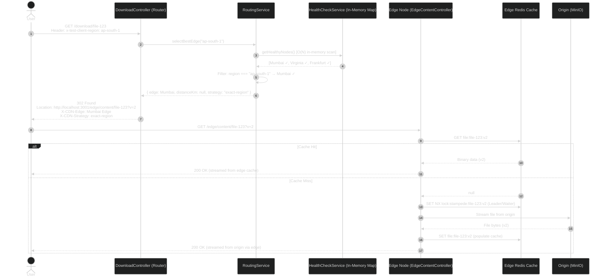

# Phase 5A: Geo-Aware Edge Routing — Detailed Design (v3)

> [!IMPORTANT]
> **Architectural Distinction:** Phase 5A optimizes **user-to-edge proximity**. It does NOT guarantee cache residency.
> A user in Mumbai will be routed to the Mumbai Edge, but that edge may not have the requested file cached — resulting in a cache miss and an origin fetch. This is a deliberate **cache-on-demand** architecture.
> Phase 5B (Consistent Hashing) will later answer the separate question: *"Which edge should own this file?"*

### The 5A vs 5B Conflict: Nearest Edge ≠ Owning Edge

Phase 5A and 5B answer two fundamentally different questions that can conflict:

| Question | Phase | Example Answer |
|---|---|---|
| Which edge is **closest to the user**? | 5A | Mumbai Edge |
| Which edge **owns this file**? | 5B | Frankfurt Edge |

When the nearest edge is NOT the owner, we need a defined resolution strategy. Our architecture will use a **layered approach**:

```
                    User
                      ↓
              Geo Routing (5A)
                      ↓
              nearest region
                      ↓
           ownership check (5B)
                      ↓
          owner/replica in region?
               /           \
             YES            NO
              │              │
              ▼              ▼
        Serve from       Cache-on-demand
        owner edge       at nearest edge
                         (origin fetch)
```

This means:
- **If the nearest edge owns the file (or is a replica):** Serve directly. Best case.
- **If the nearest edge does NOT own the file:** The nearest edge still serves the request, but experiences a cache miss and fetches from origin. The file is then cached locally for subsequent requests from that region.

This is an **eventual consistency, cache-on-demand** model. The consistent hash ring (5B) determines *proactive* replication targets, but any edge can serve any file on demand. The hash ring reduces misses, it doesn't prevent them.

> [!NOTE]
> This decision will be finalized in the Phase 5B design document. Phase 5A proceeds with pure geo-routing and does not consult ownership.

---

## 1. The Problem We Are Solving

Right now, when a user calls `GET /download/:fileId`, our `DownloadController` streams the file directly from the Origin (MinIO) or the local Redis cache. Every single user on the planet hits the same server. There is no concept of "routing to the nearest edge."

**After this change:** The `DownloadController` will act as a **Geo-Aware Router**. It will determine which Edge Node is geographically closest to the user, and respond with an **HTTP 302 Redirect**, sending the user's browser directly to that Edge Node. The Edge Node then serves the file from its own local Redis cache (or fetches from origin on a cache miss).

### What This Is (and Is Not)

This is an **educational geo-routing layer** — not a production CDN routing system. A real CDN routing layer involves DNS/Anycast, latency probing, capacity-aware traffic steering, congestion detection, and routing policies. Our implementation is a simplified but architecturally honest version that demonstrates the core concept: **route users to the nearest healthy edge.**

### Why We Use HTTP 302 (An Intentional Simplification)

The 302 redirect introduces an extra HTTP round-trip:

```
Client → Core (302) → Edge Node
```

In a production CDN, routing typically happens at the DNS layer (e.g., Route53 latency routing, Anycast) so the client never touches the origin at all. We use 302 because:
- It makes the routing decision **visible** in Bruno (you can literally see `Location: http://localhost:3001/...`)
- It is trivially testable without DNS infrastructure
- It makes the routing algorithm explainable in an interview

This will be documented as an intentional simplification, not presented as production-grade.

---

## 2. The Routing Strategy: Region-Based with Haversine Fallback

As defined in [project.md](file:///home/raj-ribadiya/Desktop/pravah/docs/project.md#L323-L333), we are implementing **Region-Based Routing** as our primary strategy.

### Decision Tree

```
User Request: GET /download/file-123
Header: x-test-client-region: ap-south-1
                    │
                    ▼
          ┌─────────────────────────┐
          │     RoutingService      │
          │                         │
          │ 0. Header present?      │
          │    └── NO ──────────────│──▶ Return null (Origin fallback)
          │                         │
          │ 1. Get HEALTHY nodes    │──▶ HealthCheckService.getHealthyNodes()
          │    └── EMPTY ───────────│──▶ Return null (Origin fallback)
          │                         │
          │ 2. Exact region match?  │──▶ Filter: node.region === "ap-south-1"
          │    └── YES (1 node) ────│──▶ Return that node
          │    └── YES (N nodes) ───│──▶ Random selection among matches
          │    └── NO ──────────────│──▶ Step 3
          │                         │
          │ 3. Known region coords? │──▶ Lookup REGION_COORDINATES
          │    └── NO (unknown) ────│──▶ Return null (Origin fallback)
          │    └── YES ─────────────│──▶ Step 4
          │                         │
          │ 4. Haversine nearest    │──▶ Calculate distance to every
          │                         │    healthy node, pick closest
          └─────────────────────────┘
                    │
                    ▼
          ┌─────────────────────────┐
          │   DownloadController    │
          │                         │
          │ Edge returned?          │
          │  └── YES ───────────────│──▶ HTTP 302 → edge endpoint URL
          │  └── NO (null) ─────────│──▶ Stream from Origin (current behavior)
          └─────────────────────────┘
```

### Definitive Fallback Rules (No Ambiguity)

| Scenario | Behavior | Rationale |
|---|---|---|
| No `x-test-client-region` header | **Origin fallback** | No geo information = no meaningful routing decision |
| Header present, zero healthy nodes | **Origin fallback** | No live edges to route to |
| Header present, unknown region string | **Origin fallback** | Unknown coordinates = unreliable geo decision |
| Header present, no exact match, known region | **Haversine nearest** | Best available geo approximation |
| Header present, exact region match | **That edge (random if multiple)** | Optimal match |

### Why Region-Based First?

| Strategy | Complexity | Testable Locally? | Interview Value |
|---|---|---|---|
| **Region-Based** ✅ | Low | Yes (mock headers) | High — simple, deterministic, easy to explain |
| Latency-Based | High | No (needs real probing) | Medium — hard to demo |
| Weighted | Medium | Yes | Low — no geo story |

---

## 3. Database Changes

### 3.1 Add Coordinates to EdgeNode

We need `latitude` and `longitude` on each Edge Node so the Haversine formula can calculate distances when there is no exact region match.

```diff
// prisma/schema.prisma

model EdgeNode {
  id            String         @id @default(uuid())
  name          String         @unique
  region        String
  endpointUrl   String
+ latitude      Float          @default(0)
+ longitude     Float          @default(0)
  status        EdgeNodeStatus @default(HEALTHY)
  lastHeartbeat DateTime?

  replications  ReplicationStatus[]

  createdAt     DateTime       @default(now())
  updatedAt     DateTime       @updatedAt

  @@index([status])
  @@index([region])
  @@map("edge_nodes")
}
```

### 3.2 Seed Data (3 Edge Nodes with Real Coordinates)

We will create a seed script that inserts 3 edge nodes simulating a global CDN:

| Name | Region | Latitude | Longitude | Endpoint URL |
|---|---|---|---|---|
| Mumbai Edge | `ap-south-1` | 19.0760 | 72.8777 | `http://localhost:3001` |
| Virginia Edge | `us-east-1` | 37.4316 | -78.6569 | `http://localhost:3002` |
| Frankfurt Edge | `eu-central-1` | 50.1109 | 8.6821 | `http://localhost:3003` |

> [!NOTE]
> These `endpointUrl`s point to different localhost ports. In Phase 5C (Microservices Split), each port will be a separate Docker container running an independent Edge Cache Service.

---

## 4. Updated `EdgeNodeRecord` Interface

The `HealthCheckService` needs to expose `latitude` and `longitude` in its in-memory map so the `RoutingService` can calculate distances without any database queries.

```diff
// health-check.service.ts

export interface EdgeNodeRecord {
  id: string;
  name: string;
  region: string;
  endpointUrl: string;
+ latitude: number;
+ longitude: number;
  status: EdgeNodeStatus;
  missedCycles: number;
}
```

> [!IMPORTANT]
> **Separation of concerns in the in-memory registry:**
>
> | Data | Source | Refresh Frequency |
> |---|---|---|
> | Static metadata (region, lat/lon, endpoint) | PostgreSQL | Every 5 minutes |
> | Live health status (HEALTHY / DEGRADED / DOWN) | Redis heartbeats | Every 5 seconds |
>
> The 5-minute DB refresh loads **static node metadata only**. It does NOT determine liveness.
> Health state comes exclusively from the 10-second heartbeat mechanism (Phase 4). If a node dies, it is detected within 15 seconds via Redis TTL expiry — not after a 5-minute DB refresh cycle.
> Both data sources feed the same in-memory `Map<string, EdgeNodeRecord>`. The routing decision never touches PostgreSQL.

---

## 5. New File: `RoutingService`

**Path:** `apps/core/src/common/routing/routing.service.ts`

This is the brain of the routing algorithm. It has zero HTTP knowledge — it only answers the question: *"Given a user's region, which Edge Node should serve them?"*

### 5.1 Region Coordinate Registry

A hardcoded lookup table mapping AWS-style region strings to their geographic center. This is used when the client sends `x-test-client-region: ap-northeast-1` — we need to know where that region physically is to calculate Haversine distance.

```typescript
// routing/region-coordinates.ts

export const REGION_COORDINATES: Record<string, { lat: number; lon: number }> = {
  'ap-south-1':     { lat: 19.0760, lon: 72.8777 },   // Mumbai
  'us-east-1':      { lat: 37.4316, lon: -78.6569 },   // Virginia
  'eu-central-1':   { lat: 50.1109, lon: 8.6821 },     // Frankfurt
  'ap-northeast-1': { lat: 35.6762, lon: 139.6503 },   // Tokyo
  'us-west-2':      { lat: 45.5231, lon: -122.6765 },  // Oregon
  'eu-west-1':      { lat: 53.3498, lon: -6.2603 },    // Ireland
  'sa-east-1':      { lat: -23.5505, lon: -46.6333 },  // São Paulo
  'ap-southeast-1': { lat: 1.3521,  lon: 103.8198 },   // Singapore
};
```

### 5.2 The Haversine Formula

**Path:** `apps/core/src/common/routing/haversine.util.ts`

This is a pure, stateless utility function. It calculates the shortest distance (in km) between two points on Earth's surface using their latitude and longitude.

```typescript
/**
 * Calculates the great-circle distance between two points on Earth.
 * Returns distance in kilometers.
 *
 * Formula:
 *   a = sin²(Δlat/2) + cos(lat1) × cos(lat2) × sin²(Δlon/2)
 *   c = 2 × atan2(√a, √(1−a))
 *   d = R × c
 *
 * Where R = 6,371 km (Earth's mean radius)
 */
export function haversineDistance(
  lat1: number, lon1: number,
  lat2: number, lon2: number,
): number {
  const R = 6371;
  const toRad = (deg: number) => (deg * Math.PI) / 180;
  const dLat = toRad(lat2 - lat1);
  const dLon = toRad(lon2 - lon1);
  const a =
    Math.sin(dLat / 2) ** 2 +
    Math.cos(toRad(lat1)) *
    Math.cos(toRad(lat2)) *
    Math.sin(dLon / 2) ** 2;
  const c = 2 * Math.atan2(Math.sqrt(a), Math.sqrt(1 - a));
  return R * c;
}
```

### 5.3 Core Routing Method

```typescript
export interface RoutingDecision {
  edge: EdgeNodeRecord;
  distanceKm: number | null;      // null when exact-region (distance not calculated)
  strategy: 'exact-region'        // Matched on region string
          | 'nearest-geo';        // Haversine fallback
}

selectBestEdge(clientRegion: string | undefined): RoutingDecision | null {
  // 0. No region provided — we have no geo info, cannot make a meaningful decision
  if (!clientRegion) return null;

  // 1. Get all healthy nodes from HealthCheckService (O(1) in-memory lookup)
  const healthyNodes = this.healthCheckService.getHealthyNodes();
  if (healthyNodes.length === 0) return null;

  // 2. Try EXACT region match first (skip Haversine entirely)
  const regionMatches = healthyNodes.filter(n => n.region === clientRegion);
  if (regionMatches.length > 0) {
    // Multiple nodes in same region → random selection (basic load distribution)
    const selected = regionMatches[Math.floor(Math.random() * regionMatches.length)];
    return { edge: selected, distanceKm: null, strategy: 'exact-region' };
  }

  // 3. No exact match — look up the region's coordinates
  const clientCoords = REGION_COORDINATES[clientRegion];
  if (!clientCoords) {
    // Unknown region string — no reliable geo decision possible
    return null;
  }

  // 4. Haversine: calculate distance to every healthy node, pick closest
  let closest: EdgeNodeRecord = healthyNodes[0];
  let minDistance = Infinity;

  for (const node of healthyNodes) {
    const dist = haversineDistance(
      clientCoords.lat, clientCoords.lon,
      node.latitude, node.longitude,
    );
    if (dist < minDistance) {
      minDistance = dist;
      closest = node;
    }
  }

  return { edge: closest, distanceKm: Math.round(minDistance), strategy: 'nearest-geo' };
}
```

> [!NOTE]
> **On the random selection:** `Math.random()` is acceptable for Phase 5A. It does not account for load, capacity, or active connections. A future improvement would be weighted selection based on a composite score (health + capacity + latency). That evolution is documented in Section 11 but intentionally deferred.

---

## 6. Controller Changes: The 302 Redirect

### 6.1 Updated `DownloadController` Flow

```
BEFORE (Phase 4):
  Client → GET /download/123 → DownloadController streams from Origin/Redis

AFTER (Phase 5A):
  Client → GET /download/123 + x-test-client-region: ap-south-1
         → RoutingService.selectBestEdge("ap-south-1")
         │
         ├─ Edge found → 302 → http://localhost:3001/api/v1/edge/content/123?v=2
         │
         └─ No edge (null) → Stream from Origin (existing Phase 4 behavior)
```

### 6.2 The Mock Header: `x-test-client-region`

Since we cannot do real IP-based geolocation in local development, the client (Bruno) sends a mock header:

```http
x-test-client-region: ap-south-1
```

> [!WARNING]
> This header is a **testing input, not trusted location information.** A client can send any value. In production (Phase 6), this will be replaced by a server-side GeoIP lookup (e.g., MaxMind) on the user's real IP address. The header will be ignored entirely in production mode.

### 6.3 The Redirect Response

```http
HTTP/1.1 302 Found
Location: http://localhost:3001/api/v1/edge/content/abc-123?v=2
X-CDN-Edge: Mumbai Edge
X-CDN-Region: ap-south-1
X-CDN-Distance-Km: N/A
X-CDN-Strategy: exact-region
```

| Header | Purpose |
|---|---|
| `Location` | Standard HTTP redirect to the selected edge |
| `X-CDN-Edge` | Human-readable name of the selected edge (debugging) |
| `X-CDN-Region` | The edge's region tag (debugging) |
| `X-CDN-Distance-Km` | Distance in km, or `N/A` if exact-region match (no calculation performed) |
| `X-CDN-Strategy` | `exact-region` or `nearest-geo` — explains *why* this edge was chosen |

These `X-CDN-*` headers are invaluable for debugging and demos. They make the routing algorithm **visible**.

---

## 7. New Endpoint: Edge Content Delivery

### 7.1 New `EdgeContentController`

**Path:** `apps/core/src/edge-content/edge-content.controller.ts`

This is the endpoint that Edge Nodes expose. When a user gets redirected here via 302, this controller serves the file from the local Redis cache, or fetches from Origin on a miss.

```
GET /api/v1/edge/content/:fileId?v=2
```

| Scenario | What Happens |
|---|---|
| **Cache Hit** | Streams directly from Redis. |
| **Cache Miss** | Fetches from MinIO origin, populates Redis, streams to user. |
| **Stampede** | Uses the Leader/Waiter lock pattern from Phase 3. |

> [!IMPORTANT]
> **Stampede Lock Granularity:** The distributed lock MUST be per **file version**, not per file.
> Correct: `lock:stampede:file-123:v2`
> Wrong: `lock:stampede:file-123`
> Because our architecture uses immutable versioning (`v1 ≠ v2`), the lock must respect version boundaries. Two requests for different versions of the same file should not block each other.

### 7.2 Why a Separate Controller?

This controller is intentionally isolated in its own NestJS module (`EdgeContentModule`). Right now it lives in the same monolith. But when we split into microservices in Phase 5C, this module is the one that gets extracted into its own Docker container — one container per Edge Node.

---

## 8. Architectural Tradeoff: Redis as Binary Cache

Our Edge Nodes currently store file binaries directly in Redis. This works for our project scope but has a known limitation:

| Aspect | Our Approach (Redis) | Production CDN (Disk + Redis) |
|---|---|---|
| Speed | Extremely fast (in-memory) | Fast (SSD) + metadata in Redis |
| Cost | Expensive (RAM per byte) | Cheap (disk per byte) |
| Max object size | ~20MB (our enforced limit) | Gigabytes |
| Scalability | Limited by RAM | Limited by disk |

**Why we keep Redis for now:** Our 20MB safety limit from Phase 4 prevents OOM. For small/medium files (images, JS, CSS, JSON), Redis is actually faster than disk. This is an honest educational tradeoff — documented, not hidden.

**Production evolution:** Edge Nodes would use local SSD for binary content and Redis only for hot metadata (ETags, version pointers, LRU scores). This is a Phase 6+ consideration.

---

## 9. Versioned Cache Keys — A Core Architectural Strength

Our immutable versioning strategy means the cache key includes the version:

```
Redis key: file:{fileId}:v{version}
```

This eliminates an entire class of cache consistency bugs:

```
User requests file-123?v=2
  → Cache key: file:file-123:v2
  → Either it exists (hit) or it doesn't (miss)
  → There is NO scenario where v1 content is served for a v2 request
```

When a new version is uploaded:
1. `cache.invalidate` event deletes all keys for that fileId (including v1)
2. Next request for v2 is a guaranteed miss
3. Origin fetch populates the cache with v2 content

**This is one of the strongest architectural decisions in the entire project and should be emphasized in interviews.**

---

## 10. New Files Summary

| File | Purpose |
|---|---|
| `src/common/routing/routing.service.ts` | Core routing logic (region match + Haversine) |
| `src/common/routing/routing.module.ts` | NestJS module for `RoutingService` |
| `src/common/routing/haversine.util.ts` | Pure function for great-circle distance |
| `src/common/routing/region-coordinates.ts` | Static lookup table: region → lat/lon |
| `src/edge-content/edge-content.controller.ts` | `GET /edge/content/:fileId` — serves files at the edge |
| `src/edge-content/edge-content.module.ts` | NestJS module for edge content delivery |
| `prisma/seed.ts` | Seed script to insert 3 edge nodes with coordinates |

---

## 11. Future Evolution: Routing Score (NOT for Phase 5A)

The current routing algorithm can naturally evolve from a single-factor decision to a multi-factor scoring system:

```
Phase 5A (now):
  score = region_match

Phase 6 (future):
  score = geo_proximity × 0.4
        + health_score  × 0.3
        + capacity      × 0.2
        + cache_residency × 0.1

                ┌──────────────────┐
                │  RoutingService  │
                └────────┬─────────┘
                         │
          ┌──────────────┼──────────────┐
          ▼              ▼              ▼
     Geo Score      Health Score    Load Score
          │              │              │
          └──────────────┼──────────────┘
                         ▼
                   Weighted Sum
                         ↓
                    Best Edge
```

**This is documented for architectural awareness. Do NOT implement in Phase 5A.** Adding scoring factors now would turn a clean phase into an unfocused mess.

---

## 12. Complete Request Flow Diagram



---

## 13. Testing Plan (Bruno)

### Test 1: Exact Region Match
```
GET http://localhost:3000/api/v1/download/<fileId>
Header: x-test-client-region: ap-south-1
```
**Expected:** `302 Found` → Location points to Mumbai Edge (`localhost:3001`)
**Verify:** `X-CDN-Strategy: exact-region`, `X-CDN-Distance-Km: N/A`

### Test 2: Nearest Region (Haversine Fallback)
```
GET http://localhost:3000/api/v1/download/<fileId>
Header: x-test-client-region: ap-northeast-1  (Tokyo — no edge there)
```
**Expected:** `302 Found` → Redirected to Mumbai Edge (closest to Tokyo at ~5,849 km)
**Verify:** `X-CDN-Strategy: nearest-geo`, `X-CDN-Distance-Km: 5849`

### Test 3: No Healthy Nodes (Origin Fallback)
Stop all heartbeats. Wait 15+ seconds for all nodes to go `DOWN`.
```
GET http://localhost:3000/api/v1/download/<fileId>
Header: x-test-client-region: ap-south-1
```
**Expected:** `200 OK` — File streamed directly from Origin
**Verify:** No `X-CDN-Edge` header present (served from origin)

### Test 4: No Region Header (Origin Fallback)
```
GET http://localhost:3000/api/v1/download/<fileId>
(No x-test-client-region header)
```
**Expected:** `200 OK` — Origin fallback (no geo info = no routing decision)

### Test 5: Multiple Edges in Same Region
Seed 3 Mumbai edges (`ap-south-1`). Send 10 requests with `x-test-client-region: ap-south-1`.
**Expected:** Requests should show **non-deterministic distribution** across available same-region edges. Exact distribution is NOT guaranteed — `Math.random()` can legitimately produce 7/3/0 splits. The test verifies that the system correctly identifies all 3 edges as candidates, not that it distributes evenly.
**Verify:** `X-CDN-Edge` header shows at least 2 different node names across 10 requests (probabilistically near-certain)

### Test 6: Edge Dies After Routing
1. Send heartbeat for Mumbai. Verify it routes to Mumbai.
2. Stop Mumbai heartbeats. Wait 15 seconds.
3. Send the same download request.
**Expected:** `302 Found` → Now redirected to the next closest healthy edge (Frankfurt or Virginia)
**Verify:** `X-CDN-Edge` changed, `X-CDN-Strategy: nearest-geo`

---

## 14. Algorithmic Complexity (Honest Assessment)

| Operation | Complexity | Notes |
|---|---|---|
| `getHealthyNodes()` | **O(N)** | Scans entire in-memory map, filters by status |
| Exact-region filtering | **O(N)** | Filters healthy nodes array by region string |
| Haversine fallback | **O(N)** | Calculates distance to every healthy node |
| Memory | **O(N)** | One `EdgeNodeRecord` per registered node |

With N = 3 to 100 edge nodes, this is trivially fast (sub-microsecond). The O(N) scans are completely acceptable and will never be a bottleneck. Documenting this honestly is technically stronger in an interview than claiming O(1).

---

## 15. What This Does NOT Cover (Explicitly Deferred)

| Feature | Why Deferred | Phase |
|---|---|---|
| **Consistent Hashing** | 5A routes to nearest edge, not the edge that *owns* this file. Those are separate questions. | 5B |
| **Microservices Split** | Edge Nodes are in the same monolith; they just have a separate controller ready for extraction | 5C |
| **Real GeoIP Lookup** | Using mock `x-test-client-region` header. Production would use MaxMind on real client IP. | 6 |
| **Latency-Based Routing** | Requires active RTT probing or DNS-level latency routing (Route53) | 6+ |
| **Weighted Load Balancing** | Random selection among same-region nodes. Future: capacity/load-aware scoring. | 6+ |
| **DNS/Anycast Routing** | 302 redirect keeps the origin in the critical path. DNS routing removes it entirely. | 6+ |
