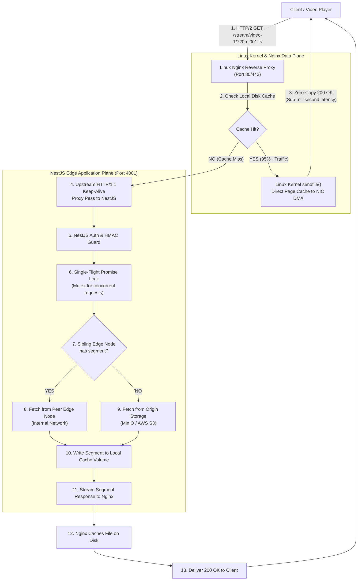
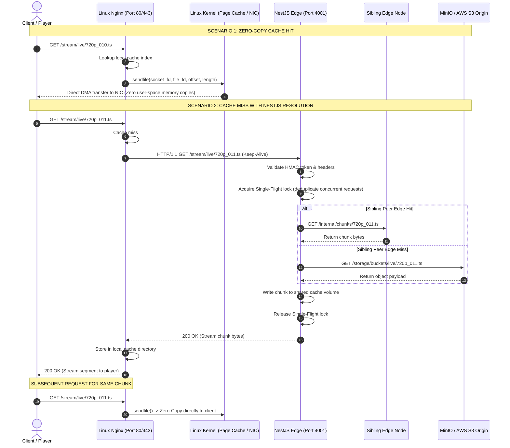

# Pravah Request Flow Architecture

This document illustrates the end-to-end request lifecycle for video streaming traffic, highlighting the interaction between the Linux Nginx Zero-Copy reverse proxy and the NestJS Edge application.

---

## 1. High-Level Architecture Flow

---

## 2. End-to-End Sequence Diagram

