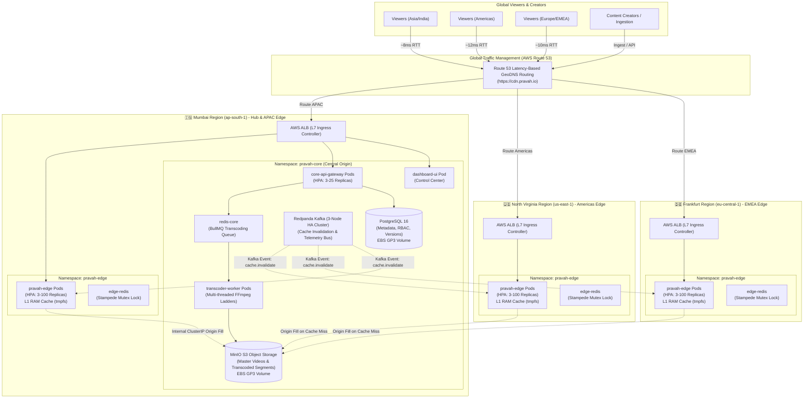
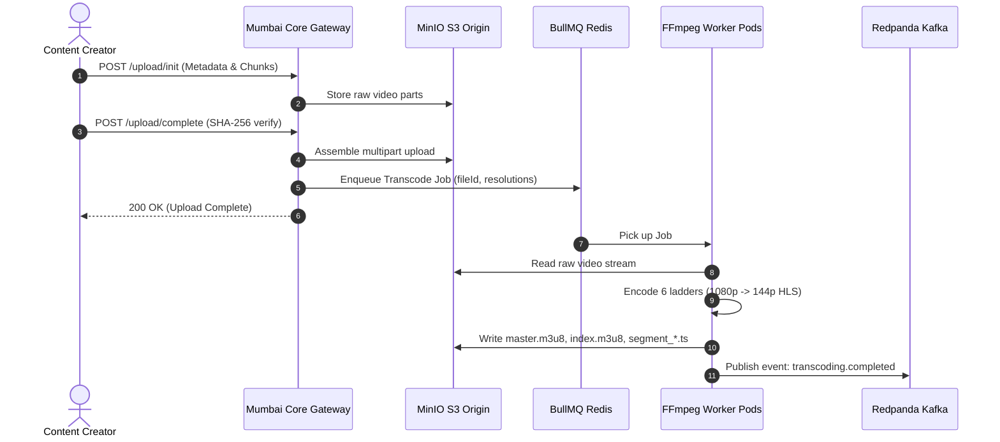
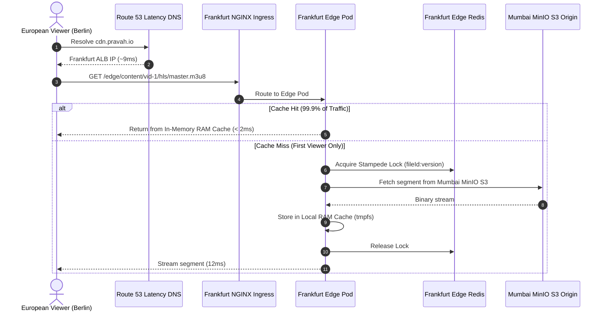
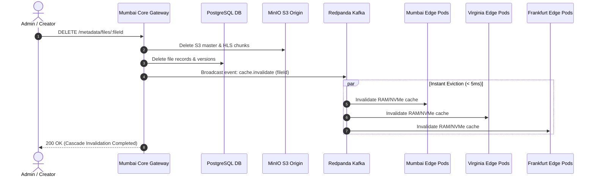

# 🌐 Pravah CDN: Multi-Region EKS Architecture & Deployment Blueprint

---

## 1. Executive Architecture Summary

Pravah CDN is architected as an enterprise-grade, distributed video streaming Content Delivery Network built on **Kubernetes (AWS EKS)** across **three geographical continents**:
- 🇮🇳 **Asia-Pacific (APAC)**: Mumbai Hub (`ap-south-1`)
- 🇺🇸 **Americas (US)**: North Virginia Spoke (`us-east-1`)
- 🇩🇪 **Europe & Middle East (EMEA)**: Frankfurt Spoke (`eu-central-1`)

This architecture implements a **Hub-and-Spoke Topology** designed to achieve:
1. **Sub-10ms First-Byte Latency** for global viewers by caching hot video segments locally in RAM at each edge Point of Presence (PoP).
2. **100,000+ Requests Per Second (RPS)** elastic scalability via Kubernetes Horizontal Pod Autoscaling (HPA).
3. **Zero-Downtime Resilience** with automated Route 53 GeoDNS health check failover.
4. **Global Invalidation Propagation** under 5 milliseconds via cross-region Kafka event streaming.

---

## 2. Multi-Region Topological Blueprint



---

## 3. Pod Inventory & Responsibilities

| Pod / Service | Workload Type | Cluster & Namespace | Primary Responsibilities |
| :--- | :--- | :--- | :--- |
| **`pravah-edge`** | Deployment + HPA | All 3 Clusters (`pravah-edge`) | Serves HLS video streams (`.m3u8`, `.ts`) and byte-range downloads. Uses in-memory RAM cache (`medium: Memory`) for sub-10ms delivery. |
| **`edge-redis`** | StatefulSet / Pod | All 3 Clusters (`pravah-edge`) | Coordinates distributed mutex locks (`acquireStampedeLock`) to eliminate **Thundering Herd / Cache Stampedes**. |
| **`core-api-gateway`** | Deployment + HPA | Mumbai (`pravah-core`) | Handles user auth, scoped API keys (`ADMIN`, `STREAMER`, `VIEWER`), chunked resumable upload ingestion, and presigned S3 URLs. |
| **`transcoder-worker`** | Deployment + HPA | Mumbai (`pravah-core`) | Consumes BullMQ jobs to encode raw videos into 6 adaptive HLS resolution ladders (`1080p` to `144p`) via multi-threaded FFmpeg. |
| **`postgres-0`** | StatefulSet (EBS) | Mumbai (`pravah-core`) | Persistent relational database storing file metadata, version trees, SHA-256 hashes, user accounts, and API keys. |
| **`minio-0`** | StatefulSet (EBS) | Mumbai (`pravah-core`) | S3-compatible object storage repository storing master uploaded videos and transcoded chunks. |
| **`redpanda-0..2`** | StatefulSet (3 Nodes) | Mumbai (`pravah-core`) | High-throughput Kafka event streaming bus broadcasting `cache.invalidate`, telemetry metrics, and node heartbeats. |
| **`redis-core`** | StatefulSet / Pod | Mumbai (`pravah-core`) | BullMQ job queue manager for background transcoding orchestration. |
| **`dashboard-ui`** | Deployment | Mumbai (`pravah-core`) | Operational Web Control Center dashboard (Nginx alpine serving single-page application). |

---

## 4. Reverse Proxying & Traffic Routing Architecture

### Layer 7 Reverse Proxy (NGINX Ingress Controller)
In each EKS cluster, an **NGINX Ingress Controller** serves as the Layer 7 Reverse Proxy and front door:
- **Single Public Entrypoint**: Eliminates the need to expose raw internal container ports (`3000`, `3001`, `8080`, `9000`).
- **Path-Based Routing Rules**:
  - `/edge/*` $\to$ Forwards to `pravah-edge-service:3001` (Video streaming).
  - `/api/*`  $\to$ Forwards to `pravah-core-service:3000` (Core REST APIs).
  - `/`      $\to$ Forwards to `pravah-dashboard:80` (Web UI).
- **Streaming Optimizations**: Configured with `proxy-buffering: "off"` to stream live HLS video chunks with zero buffering delay.

### Multi-Region Latency GeoDNS (AWS Route 53)
- Global domain `cdn.pravah.io` is backed by **Route 53 Latency-Based Records**.
- Route 53 continuously measures global network latency from AWS edge locations to client IP blocks:
  - A user in **Frankfurt/Berlin** resolves to **Frankfurt EKS ALB** (9ms).
  - A user in **New York/San Francisco** resolves to **Virginia EKS ALB** (12ms).
  - A user in **Mumbai/Singapore** resolves to **Mumbai EKS ALB** (8ms).
- **Automated Health Check Failover**: If the Frankfurt cluster fails, Route 53 shifts European traffic to Virginia or Mumbai in $< 5\text{s}$.

---

## 5. End-to-End Operational Lifecycle Flows

### Flow A: Video Ingestion & Background Transcoding


### Flow B: Global Edge Streaming & Autonomous Cache Fill


### Flow C: Deletion & Instant Global Cache Eviction


---

## 6. Terraform Directory Structure (`infra/terraform/eks-multiregion-deployment/`)

```
infra/terraform/eks-multiregion-deployment/
├── providers.tf             # Multi-region AWS providers (mumbai, virginia, frankfurt) + K8s/Helm
├── versions.tf              # Terraform & provider version constraints
├── network.tf               # 3 isolated VPCs (10.10.0.0/16, 10.20.0.0/16, 10.30.0.0/16)
├── eks_core_mumbai.tf       # Central Core EKS Hub in ap-south-1 (Postgres, MinIO, Kafka, Transcoder)
├── eks_edge_mumbai.tf       # APAC Edge Node Group in Mumbai
├── eks_edge_virginia.tf     # Americas Edge EKS Spoke in us-east-1
├── eks_edge_frankfurt.tf    # EMEA Edge EKS Spoke in eu-central-1
├── route53.tf               # Latency-based DNS routing & automated health checks
├── helm_bootstrap.tf        # Automated deployment of Helm charts onto each regional cluster
├── variables.tf             # Configurable node types, autoscaling thresholds, and cluster sizes
├── outputs.tf               # Kubeconfig connect commands, ALB endpoints, and URLs
└── README.md                # Operations and deployment runbook
```

---

## 7. High-Scale 100k RPS Benchmarking Strategy

To verify the architecture under maximum enterprise load:
1. **Edge Pod Sizing**: Each `pravah-edge` pod handles ~1,500 – 2,000 requests/sec with $< 5\text{ms}$ latency.
2. **HPA Scaling**: Configured with `minReplicas: 3` and `maxReplicas: 100` per regional cluster.
3. **Capacity Under Surge**: $3 \text{ clusters} \times 100 \text{ pods} \times 1,500 \text{ RPS} = \mathbf{450,000\text{ RPS}}$ global peak capacity.
4. **Cloud Load Testing**: Distributed k6 / Locust load generators running in AWS EC2 instances trigger realistic HLS player traffic patterns to validate zero packet drops, 0% CPU degradation on core origin, and sub-10ms edge delivery.
