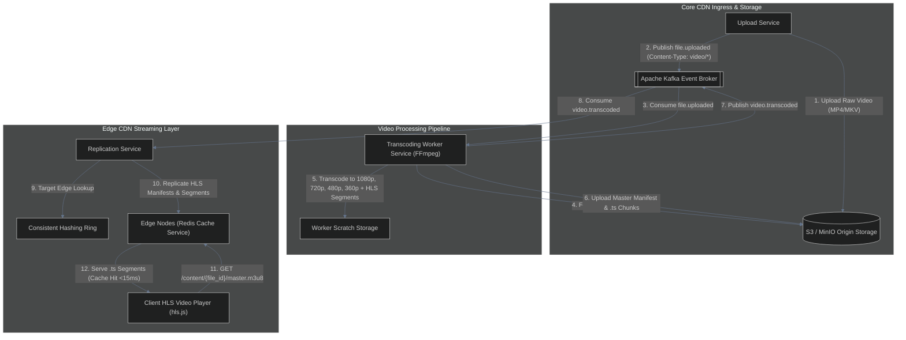

# Distributed CDN — Multi-Quality Video Transcoding & HLS Streaming Extension

This specification document details the future extension plan for integrating **YouTube-style Multi-Quality Video Transcoding** and **Adaptive Bitrate Streaming (HLS - HTTP Live Streaming)** into the existing Distributed CDN architecture.

---

## 1. Executive Summary & Concept

Currently, the CDN handles raw binary uploads and serves single video files with Range Request support. This extension introduces a **Transcoding Worker Service** powered by **FFmpeg** to automatically process uploaded videos into multiple resolutions (`1080p`, `720p`, `480p`, `360p`) and segment them into **HLS (`.m3u8` & `.ts`) streams**.

### Key Benefits:
- **Adaptive Bitrate (ABR) Streaming:** Downloader web players automatically switch resolutions based on real-time network speed (e.g., seamless fallback from `1080p` on Wi-Fi to `360p` on mobile data without buffering).
- **High Edge Cache Hit Ratio:** Small 2-to-6 second video segments (`.ts` files) are cached independently at Edge Redis nodes, drastically reducing origin load.
- **Zero Core Rewrites:** Plugs directly into the existing event-driven Kafka architecture as an independent consumer.

---

## 2. Architecture & Sequence Flow



---

## 3. Database Schema Extensions (PostgreSQL)

To track transcoding sessions and generated resolutions, add the `video_transcodes` table:

```sql
-- Transcoding task status and variant metadata
CREATE TABLE video_transcodes (
    id UUID PRIMARY KEY DEFAULT gen_random_uuid(),
    file_id UUID NOT NULL REFERENCES files(id) ON DELETE CASCADE,
    master_manifest_path VARCHAR(512) NOT NULL,
    resolutions_available VARCHAR(100)[] NOT NULL, -- e.g., ['1080p', '720p', '480p', '360p']
    status VARCHAR(50) NOT NULL DEFAULT 'processing', -- 'processing', 'completed', 'failed'
    duration_seconds INT,
    error_message TEXT,
    created_at TIMESTAMP WITH TIME ZONE DEFAULT CURRENT_TIMESTAMP,
    completed_at TIMESTAMP WITH TIME ZONE
);

CREATE INDEX idx_video_transcodes_file_id ON video_transcodes(file_id);
```

---

## 4. Kafka Event Schemas for Transcoding

### `video.processing_requested`
Published when a video file upload is finalized:
```json
{
  "event_id": "uuid-v4",
  "file_id": "uuid-v4",
  "owner_id": "uuid-v4",
  "raw_storage_path": "user_id/file_id/v1/original.mp4",
  "content_type": "video/mp4",
  "timestamp": "2026-07-26T18:00:00Z"
}
```

### `video.transcoded`
Published when FFmpeg finishes multi-resolution segmenting:
```json
{
  "event_id": "uuid-v4",
  "file_id": "uuid-v4",
  "master_manifest": "user_id/file_id/hls/master.m3u8",
  "resolutions": ["1080p", "720p", "480p", "360p"],
  "total_segments": 142,
  "timestamp": "2026-07-26T18:03:30Z"
}
```

---

## 5. Storage Directory Layout (S3 / MinIO)

```
bucket/
  {user_id}/
    {file_id}/
      v1/
        original.mp4.gz           (Raw source file)
      hls/                        (Transcoded HLS output)
        master.m3u8               (Master playlist linking all variants)
        1080p/
          index.m3u8              (Variant playlist)
          segment-000.ts          (2-second HLS video segment)
          segment-001.ts
        720p/
          index.m3u8
          segment-000.ts
          segment-001.ts
        480p/
          index.m3u8
          segment-000.ts
          segment-001.ts
        360p/
          index.m3u8
          segment-000.ts
          segment-001.ts
```

---

## 6. FFmpeg Transcoding Command Blueprint

The worker service executes the following FFmpeg multi-output pipeline in parallel:

```bash
ffmpeg -i input_original.mp4 \
  -filter_complex \
  "[0:v]split=4[v1,v2,v3,v4]; \
   [v1]scale=w=1920:h=1080[v1out]; \
   [v2]scale=w=1280:h=720[v2out]; \
   [v3]scale=w=854:h=480[v3out]; \
   [v4]scale=w=640:h=360[v4out]" \
  -map "[v1out]" -map 0:a -c:v:0 libx264 -b:v:0 5000k -maxrate:v:0 5350k -bufsize:v:0 7500k \
  -map "[v2out]" -map 0:a -c:v:1 libx264 -b:v:1 3000k -maxrate:v:1 3200k -bufsize:v:1 4500k \
  -map "[v3out]" -map 0:a -c:v:2 libx264 -b:v:2 1400k -maxrate:v:2 1500k -bufsize:v:2 2100k \
  -map "[v4out]" -map 0:a -c:v:3 libx264 -b:v:3 800k  -maxrate:v:3 850k  -bufsize:v:3 1200k \
  -c:a aac -b:a 128k \
  -f hls \
  -hls_time 4 \
  -hls_playlist_type vod \
  -hls_segment_filename "hls/%v/segment-%03d.ts" \
  -master_pl_name "master.m3u8" \
  -var_stream_map "v:0,a:0,name:1080p v:1,a:1,name:720p v:2,a:2,name:480p v:3,a:3,name:360p" \
  hls/%v/index.m3u8
```

---

## 7. Edge Caching & Replication Strategy for HLS

1. **Manifest Playlists (`.m3u8`):**
   - Short TTL (e.g., 60 seconds) or validated via `ETag` / `If-None-Match` headers to allow dynamic updates.
2. **Video Segment Files (`.ts`):**
   - Long TTL / Permanent LRU Cache at Edge Redis nodes.
   - Because `.ts` segments are **immutable static binary blocks**, once cached on an edge server, subsequent playback requests hit Redis with **<15ms latency** and 0% origin load.
3. **Selective Replication:**
   - Popular lower resolutions (`720p`, `480p`) can be aggressively replicated to all edges, while `1080p` can be fetched from origin on demand (cache miss) to save edge disk space.

---

## 8. Client Video Player Integration (HTML5 + HLS.js)

In the frontend application, integrate `hls.js` to enable automatic quality switching:

```html
<video id="video-player" controls width="800"></video>

<script src="https://cdn.jsdelivr.net/npm/hls.js@latest"></script>
<script>
  const video = document.getElementById('video-player');
  // Download Service returns signed CDN URL for the master playlist
  const videoSrc = 'https://edge-eu.cdn.net/content/file-uuid/hls/master.m3u8';

  if (Hls.isSupported()) {
    const hls = new Hls({
      capLevelToPlayerSize: true // Automatically restricts quality based on player display size
    });
    hls.loadSource(videoSrc);
    hls.attachMedia(video);
    hls.on(Hls.Events.MANIFEST_PARSED, function() {
      video.play();
    });
  } else if (video.canPlayType('application/vnd.apple.mpegurl')) {
    // Native Safari HLS support
    video.src = videoSrc;
  }
</script>
```

---

## 9. Implementation Checklist (Future Phase)

- [ ] Add `FFmpeg` binary to Transcoding Service Docker container.
- [ ] Create `video.processing_requested` and `video.transcoded` Kafka topics.
- [ ] Implement `video_transcodes` table in PostgreSQL.
- [ ] Build NestJS `TranscodeService` worker to download raw file, execute FFmpeg, and upload HLS directory.
- [ ] Update `Replication Service` to handle folder/segment batch replication.
- [ ] Test ABR resolution switching under simulated network throttling (Chrome DevTools 3G mode).
