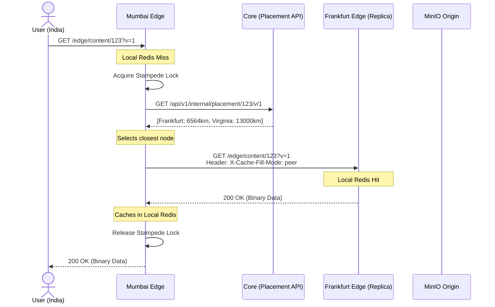

# Phase 5: Global CDN & Tiered Caching — Final Detailed Report

> **Date:** 2026-08-09
> **Status:** ✅ FULLY IMPLEMENTED & TESTED
> **Scope:** `apps/core` (Placement API, Proactive Replication) + `apps/edge` (Tiered Cache Fill, Local Redis)

---

## 1. The Architectural Gap (Before Phase 5C)

Prior to Phase 5C, we had successfully built two isolated systems:
1. **Geo-Aware Routing (5A):** Directed users to the closest geographic edge node via HTTP 302 redirects.
2. **Consistent Hashing (5B):** Assigned permanent "responsible replicas" for every file across the globe (e.g., Tokyo, Frankfurt, Virginia).

**The Problem:** These two systems didn't talk to each other. 
If a user in Ahmedabad was routed to the **Mumbai Edge**, and Mumbai suffered a cache miss, Mumbai would blindly fetch the file straight from the **MinIO Origin**. The fact that Tokyo, Frankfurt, and Virginia possessed proactive copies of the file was completely ignored. The replicas were useless for serving cache misses.

---

## 2. What We Built (Phase 5C Implementation)

To bridge this gap, we implemented a **Tiered / Peer-Assisted Cache Fill** architecture.

### A. The Core Placement API (`apps/core`)
We built a new internal endpoint: `GET /api/v1/internal/placement/:fileId/v/:version`
When called by an edge node, this API:
1. Looks up the file metadata from PostgreSQL.
2. Runs the file ID through the **Consistent HashRing** to find the 3 responsible replicas.
3. Filters the replicas against the in-memory **HealthCheck** map (ignoring `DOWN` nodes).
4. Excludes the requesting edge node (to prevent a node fetching from itself).
5. Calculates the **Haversine geographic distance** between the requesting edge and each candidate.
6. Returns the candidates **sorted by distance**.

### B. The Tiered Cache-Fill Algorithm (`apps/edge`)
We completely rewrote the `EdgeContentController` to follow a strict 6-step fallback chain:

1. **Peer Mode Check (Loop Prevention):** If the request has `X-Cache-Fill-Mode: peer`, it only checks local Redis. If missed, it returns 404. It never falls back to origin.
2. **Local Cache Check:** Standard Redis check.
3. **Stampede Lock:** Acquires a Redis lock so 100 concurrent requests don't spawn 100 origin fetches.
4. **Placement Lookup:** Asks the Core Placement API for the nearest replicas.
5. **Peer-Assisted Fetch:** Attempts to HTTP `GET` the file from the nearest peer using `X-Cache-Fill-Mode: peer`. If 200 OK, it caches locally and serves. If 404 or timeout, it tries the next peer.
6. **Origin Fallback:** If all peers fail (or if the Placement API fails), it gracefully degrades to streaming the file directly from MinIO.

---

## 3. The Debugging & Hardening Process

During integration testing, we encountered three critical bugs that threatened the architecture. Here is exactly how we debugged and resolved them:

### Bug 1: The "Shared Cache" Illusion
* **Symptom:** Hitting an edge node that was *not* a responsible replica resulted in an instant `[Cache Hit]`, entirely bypassing the Peer Fetch logic.
* **Root Cause:** All 3 local Edge Nodes were connecting to the same default Redis database (`localhost:6379 db:0`). When one node proactively cached the file, the other nodes could instantly "see" it because they shared the exact same memory space.
* **Resolution:** We modified `EdgeCacheService` to accept a `REDIS_DB` environment variable. We restarted the nodes with `REDIS_DB=1`, `REDIS_DB=2`, and `REDIS_DB=3`, enforcing strict physical isolation locally.

### Bug 2: The Core Job-Stealing Bug
* **Symptom:** Core terminals were logging `WARN [ReplicationProcessor] Replication attempt 1 failed...` instead of the Edge terminals.
* **Root Cause:** During the Phase 4 microservice extraction, we correctly moved `ReplicationProcessor` to `apps/edge`, but we forgot to remove it from `apps/core/src/replication/replication.module.ts`. Because Core and Edge shared the same BullMQ Redis instance, Core was actively stealing replication jobs off the queue and crashing.
* **Resolution:** Removed `ReplicationProcessor` from the Core module providers.

### Bug 3: The UUID vs Integer Cache Key Mismatch
* **Symptom:** Peer fetches were returning 404s even when the peer had successfully finished proactive replication.
* **Root Cause:** 
  - The Kafka `file.uploaded` event sent the `versionId` as a **UUID** (e.g., `98e14ba1-...`).
  - The edge's proactive replication worker cached the file in Redis as `file:<fileId>:<UUID>:data`.
  - The edge's runtime fetch controller (`EdgeContentController`) parsed the query parameter `?v=1` and looked for the cache key `file:<fileId>:1:data`.
  - Because `1` != `UUID`, the peer fetch failed.
* **Resolution:** Updated `ReplicationService` in Core to query the `FileVersion` table by UUID, extract the integer `versionNumber`, and inject the integer (e.g., `"1"`) into the BullMQ job payload.

---

## 4. Final Architecture Flow (Tested & Verified)

With the bugs squashed, the architecture behaves exactly as designed:

1. **Upload:** File `2e6ec556...` is uploaded.
2. **Proactive Placement:** HashRing assigns it to **Virginia (US)** and **Frankfurt (EU)**.
3. **Replication:** BullMQ jobs execute on Virginia and Frankfurt, fetching the file from MinIO and caching it in their isolated Redis DBs under key `file:...:1:data`.
4. **Cache Miss:** A user hits **Mumbai (India)** for the file. Mumbai checks its Redis DB (Miss).
5. **Placement API:** Mumbai asks Core, which returns `[Frankfurt: 6564km, Virginia: 13000km]`.
6. **Peer Fetch:** Mumbai fires an HTTP request to Frankfurt with `X-Cache-Fill-Mode: peer`.
7. **Delivery:** Frankfurt serves the file from RAM. Mumbai receives it, caches it locally in its own Redis DB, and serves the user.

---

## 5. Next Steps

With Phase 5 complete, Pravah is functionally a modern, distributed CDN. 

**Future Phases (6 & 7) will focus on:**
- **Infrastructure:** Deploying `apps/core` and `apps/edge` to actual AWS EC2 instances across global regions.
- **Observability:** Setting up Prometheus and Grafana dashboards to monitor cache hit ratios, peer fetch latencies, and origin offload percentages.
- **Hardening:** Adding mTLS for edge-to-edge peer communication and handling dynamic HashRing rebalancing when nodes crash.
