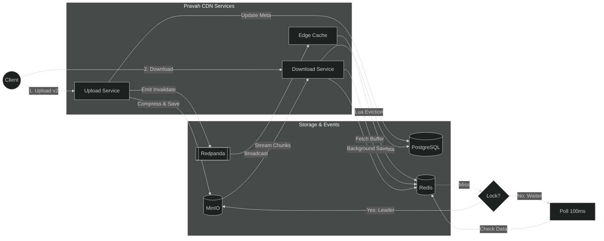

# Pravah CDN: Phase 0 to 3 Implementation Report

## Executive Summary
This report details the exact technical implementation completed during Phases 0 through 3 of the Pravah CDN project. It reflects the real codebase structure, algorithms, and architectural decisions implemented in the NestJS application, transitioning from a basic monolith to an event-driven, fault-tolerant caching system.

---

## Phase 0: Design & Infrastructure Setup
**Objective:** Establish the foundational infrastructure and application skeleton.

**Implementation Details:**
- **Infrastructure Setup:** Created `docker-compose.yml` to run the core dependencies locally:
  - PostgreSQL 16 (Relational Metadata)
  - Redis 7 (Edge Cache & Distributed Locks)
  - MinIO (Local S3-compatible Origin Storage)
  - Redpanda (High-performance Kafka-compatible broker without Zookeeper)
- **Application Skeleton:** Bootstrapped the NestJS core module structure (`AppModule`, `UploadModule`, `DownloadModule`, `MetadataModule`, `KafkaModule`, `MinioModule`).
- **Database Schema:** Defined the initial Prisma schema containing `User`, `File`, and `FileChunk` models.

---

## Phase 1: Core Storage & Assembly
**Objective:** Build a robust, fault-tolerant upload and download pipeline.

**Implementation Details:**
- **Chunked Resumable Uploads:** 
  - Created endpoints in `UploadController` for initiating sessions (`POST /uploads`) and accepting binary chunks (`PUT /uploads/:id/chunk/:index`).
  - Stored chunk metadata in PostgreSQL and chunk binaries in MinIO (`/chunks/chunk-{index}`).
- **Origin Assembly & Compression:** 
  - In `UploadService.completeUpload()`, we implemented logic to read all chunks sequentially from MinIO.
  - Applied Node.js `zlib.createGzip()` to compress textual/compressible payloads dynamically.
  - Assembled the final compressed object in MinIO at `bucket/v1/original.ext.gz` and deleted the temporary chunks.
- **Range Request Downloads:** 
  - Built `DownloadService.processDownload()` to handle HTTP `Range` headers.
  - Interfaced with MinIO using `getObjectStreamWithRange` to support `206 Partial Content` delivery (e.g., video scrubbing) directly from origin.

---

## Phase 2: Edge Caching & Object Versioning
**Objective:** Introduce DB-less edge delivery, Redis caching, and immutable versioning.

**Implementation Details:**
- **Immutable Object Versioning:** 
  - Added the `FileVersion` Prisma model. When an existing file is updated, `UploadService` does not overwrite the old object. Instead, it increments `currentVersion` (e.g., v1 -> v2).
- **Redis Edge Cache Integration:** 
  - Created `EdgeCacheService` to handle direct Redis communication.
  - Implemented `cacheFile()` using a **Redis Pipeline** to atomically save binary buffers, metadata (`HSET`), update the `current` version pointer, and track the file in a `ZSET` (`cache:lru`) for Least-Recently-Used tracking.
  - Implemented `enforceLruLimits()` to continuously check the `cache:size` tracker and automatically evict the oldest files if the 20MB memory limit is breached.
- **HTTP 304 ETags:** 
  - Injected `ETag` generation based on file checksums. If a client's `If-None-Match` header matches the Redis ETag, the server instantly throws a `304 Not Modified` exception, saving bandwidth.
- **Telemetry Hooks:** 
  - Configured Kafka producer in `KafkaService` and added `emitCacheHit()` / `emitCacheMiss()` hooks inside the Redis lookup functions for future analytics.

---

## Phase 3: Event-Driven Invalidation & Stampede Protection
**Objective:** Ensure cache consistency across a distributed cluster and prevent MinIO failure under massive concurrent load.

**Implementation Details:**
- **Kafka Hybrid Microservice:** 
  - Modified `main.ts` to configure NestJS as a Kafka Microservice with a randomized `groupId`. This ensures that *every* edge node instance receives broadcasted events, rather than load-balancing them.
- **Cluster-Wide Auto-Invalidation:** 
  - Updated `UploadService`: upon successfully committing a v2 upload, it emits a `cache.invalidate` event via Kafka.
  - `EdgeCacheController` consumes this event and triggers `evictFile()`. 
  - **O(1) Lua Eviction:** Instead of using slow, blocking `KEYS *` commands, we implemented tracking Sets (`SADD file:{fileId}:keys`). During eviction, `SMEMBERS` retrieves the exact keys, and a Lua script atomically deletes them while updating the `cache:size` counter.
- **Admin Purge API:** 
  - Added `POST /api/v1/admin/cache/purge` to allow manual broadcasting of the invalidation event.
- **Advanced Cache Stampede Protection (The "Leader/Waiter" Pattern):**
  - Refactored `DownloadService` to handle massive concurrent traffic.
  - **The Lock:** Added `acquireStampedeLock()` using Redis `SET NX PX 10000` with a generated UUID to prevent lock stealing.
  - **Active Polling:** Waiters (requests that fail to get the lock) enter `waitForCache()`, which loops every 100ms querying Redis until the Leader finishes downloading the file.
  - **Stream Decoupling:** When the Leader fetches from MinIO, it splits the data using Node.js `PassThrough` streams. One stream goes to the client, and the other goes to `cacheFile()`. This guarantees that if the client disconnects prematurely, the background cache population still completes successfully.

---

## Current System Flow (End of Phase 3)

The following Mermaid diagram maps out the complete programmatic flow, incorporating all components built up to this point.

```mermaid
%%{init: {'theme': 'dark'}}%%
sequenceDiagram
    autonumber
    actor Client
    participant UploadSvc as Upload Service
    participant DownloadSvc as Download Service
    participant EdgeCache as Edge Cache (Redis)
    participant DB as Postgres DB
    participant MinIO as Origin (MinIO)
    participant Kafka as Event Bus (Redpanda)

    rect rgb(20, 40, 30)
        Note over Client, Kafka: 1. UPLOAD & VERSIONING FLOW
        Client->>UploadSvc: PUT /uploads/{fileId}/complete (Version 2)
        UploadSvc->>MinIO: Assemble chunks & compress -> bucket/v2/object.gz
        UploadSvc->>DB: INSERT file_versions (v2), UPDATE files (current_version=2)
        UploadSvc->>Kafka: Publish "file.uploaded" & "cache.invalidate"
    end

    rect rgb(50, 20, 20)
        Note over EdgeCache, Kafka: 2. CLUSTER-WIDE EVICTION FLOW
        Kafka-->>EdgeCache: Consume "cache.invalidate" (via Microservice Listener)
        EdgeCache->>EdgeCache: SMEMBERS file:{fileId}:keys
        EdgeCache->>EdgeCache: Execute Lua Script: DEL data, DEL metadata, ZREM lru
    end

    rect rgb(20, 30, 50)
        Note over Client, Kafka: 3. DOWNLOAD & CACHE MISS (LEADER)
        Client->>DownloadSvc: GET /download/{fileId}
        DownloadSvc->>DB: Resolve Metadata (Points to v2)
        DownloadSvc->>EdgeCache: getBinary() -> MISS
        DownloadSvc->>EdgeCache: acquireStampedeLock() -> Acquired (SET NX)
        DownloadSvc->>MinIO: getObjectStream()
        DownloadSvc-->>Client: Stream to Client (via PassThrough 1)
        DownloadSvc->>EdgeCache: Stream to Cache Background (via PassThrough 2)
        DownloadSvc->>Kafka: Publish "cache.access" (Miss)
    end

    rect rgb(40, 40, 20)
        Note over Client, Kafka: 4. DOWNLOAD & CACHE HIT (STAMPEDE WAITER)
        Client->>DownloadSvc: GET /download/{fileId} (Concurrent Request)
        DownloadSvc->>EdgeCache: getBinary() -> MISS
        DownloadSvc->>EdgeCache: acquireStampedeLock() -> FAILED
        DownloadSvc->>EdgeCache: waitForCache(100ms interval)...
        Note right of EdgeCache: Leader finishes background caching
        EdgeCache-->>DownloadSvc: Binary Buffer found!
        DownloadSvc-->>Client: Serve Buffer directly from RAM
        DownloadSvc->>Kafka: Publish "cache.access" (Hit)
    end
```

## System Architecture Flowchart

The following flowchart represents the exact same system logic and routing paths as the sequence diagram above, but visualized from a component architecture perspective.

