# Pravah CDN: Phase 4 & 5A Implementation Report

## Executive Summary
This report details the implementation completed during Phase 4 (Health & Replication) and Phase 5A (Geo-Aware Edge Routing) of the Pravah CDN project. It documents how the system transitioned from a single-node cache to a geo-distributed routing architecture capable of dynamically sending clients to the physically closest healthy edge node.

---

## Phase 4: Multi-Edge Health Checks
**Objective:** Establish a robust mechanism for tracking the liveness and availability of distributed edge nodes.

**Implementation Details:**
- **Edge Node Schema:** Added the `EdgeNode` model to Prisma to track `name`, `region`, `endpointUrl`, and health `status`.
- **Heartbeat Receiver:** Implemented `POST /admin/health/heartbeat` for edges to report their liveness via a temporary Redis key (`edge:{id}:heartbeat` with a 10s TTL).
- **Active Cron Monitor:** 
  - `HealthCheckService` runs a `@Cron` job every 10 seconds.
  - It checks Redis for the existence of heartbeat keys.
  - If a key is missing, the node's `missedCycles` increments, degrading its state from `HEALTHY` -> `DEGRADED` (1 miss) -> `DOWN` (3 misses).
- **Event-Driven State Changes:** When a node changes status, a Kafka event (`edge.health_changed`) is emitted to the cluster.

---

## Phase 5A: Geo-Aware Edge Routing
**Objective:** Intelligently route user downloads to the nearest available edge node to minimize latency, with automatic failover to the origin.

**Implementation Details:**
- **Geographic Coordinates:** 
  - Updated the `EdgeNode` schema with `latitude` and `longitude` fields.
  - Wrote a Prisma seed script to initialize 3 global nodes (Mumbai, Virginia, Frankfurt).
- **O(N) In-Memory Lookup:** 
  - To prevent routing overhead, `HealthCheckService` maintains an in-memory `Map` of all nodes.
  - A 5-minute cron job refreshes the metadata from PostgreSQL, while the 10-second heartbeat cron instantly updates the `status` flag in memory.
- **The Routing Engine:** 
  - Created `RoutingService` and `haversine.util.ts`.
  - Determines the best node using two strategies:
    1. **Exact Region Match:** If the client's region directly matches a healthy edge's region.
    2. **Haversine Geo-Fallback:** If no exact match exists, it calculates the great-circle physical distance to all healthy nodes and selects the closest one.
- **HTTP 302 Redirection:** 
  - `DownloadController` reads the `x-test-client-region` header.
  - It queries the `RoutingService`. If a healthy edge is found, it issues an **HTTP 302 Found** redirect with `X-CDN-Strategy` and `X-CDN-Distance-Km` headers.
  - If no healthy edges exist, it falls back to serving the file directly from the Origin.
- **Edge Content Controller:**
  - Created a new controller to act as the "Edge Node" for Phase 5A (prior to the microservices split in 5C).
  - Implements the "Leader/Waiter" stampede lock, but scopes the lock key explicitly to the **file version** (`lock:stampede:{fileId}:v{version}`) to prevent cross-version blocking.

---

## Current System Flow (End of Phase 5A)

The following Mermaid diagram maps out the complete routing and failover flow when a client requests a file download.

```mermaid
%%{init: {'theme': 'dark'}}%%
sequenceDiagram
    autonumber
    actor Client
    participant DL as Download Controller
    participant Router as Routing Service
    participant Health as Health Check Map (RAM)
    participant Edge as Edge Content Controller
    participant Cache as Redis (Edge)
    participant MinIO as Origin (MinIO)

    rect rgb(20, 30, 50)
        Note over Client, MinIO: GEO-ROUTING (CACHE HIT)
        Client->>DL: GET /download/{fileId} (Region: Tokyo)
        DL->>Router: selectBestEdge("ap-northeast-1")
        Router->>Health: getHealthyNodes()
        Health-->>Router: [Mumbai, Virginia, Frankfurt]
        Router->>Router: Haversine fallback -> Pick Mumbai (6720km)
        Router-->>DL: RoutingDecision(Mumbai)
        DL-->>Client: 302 Redirect to Mumbai Edge URL
        Client->>Edge: GET /edge/content/{fileId}?v=1
        Edge->>Cache: getBinary()
        Cache-->>Edge: Buffer (HIT)
        Edge-->>Client: Stream binary (200 OK)
    end

    rect rgb(50, 20, 20)
        Note over Client, MinIO: GEO-ROUTING (CACHE MISS + LOCK)
        Client->>Edge: GET /edge/content/{fileId}?v=2
        Edge->>Cache: getBinary() -> MISS
        Edge->>Cache: acquireStampedeLock(v2) -> Acquired
        Edge->>MinIO: getObjectStream()
        Edge->>Cache: Background cacheFile()
        Edge-->>Client: Stream binary (200 OK)
    end

    rect rgb(40, 40, 20)
        Note over Client, MinIO: ALL EDGES DOWN (ORIGIN FALLBACK)
        Client->>DL: GET /download/{fileId} (Region: Tokyo)
        DL->>Router: selectBestEdge("ap-northeast-1")
        Router->>Health: getHealthyNodes()
        Health-->>Router: [] (All edges DOWN due to missed heartbeats)
        Router-->>DL: null
        DL->>MinIO: getObjectStream() (Bypass edge layer)
        DL-->>Client: Stream binary directly from Origin (200 OK)
    end
```

