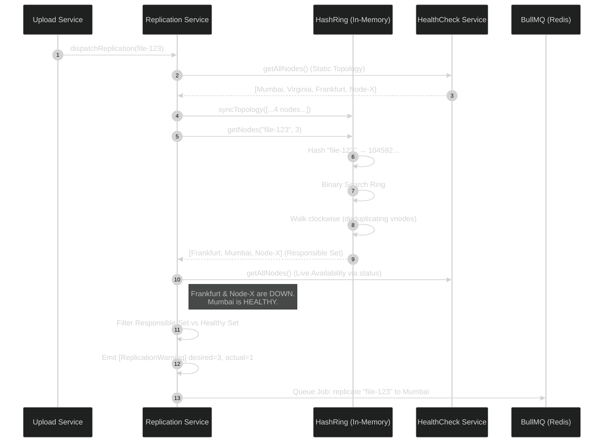

# Pravah CDN: Phase 5B Implementation Report

## Executive Summary
This report details the implementation of Phase 5B (Consistent Hashing & Replica Placement) for the Pravah CDN. It documents the transition from random edge replica selection to a highly deterministic, stable, and fault-tolerant ownership topology.

---

## 1. The HashRing Utility

**Path:** `apps/core/src/common/replication/hash-ring.ts`

To guarantee deterministic file placement while minimizing rebalancing during node churn, we implemented a custom `HashRing` class.

### Key Features:
- **Pluggable Hashing:** Uses Node's native `crypto.createHash('md5')` converted to a 32-bit unsigned integer to map strings onto a 360-degree continuous ring.
- **Virtual Nodes:** Each physical edge node is injected into the ring 100 times (`nodeId:vnode:0` to `99`). This mitigates the clustering problem inherent in basic consistent hashing and guarantees an even distribution of files across all nodes.
- **O(log N) Lookups:** The internal ring hashes are maintained in a sorted array, allowing `getNodes()` to use Binary Search to find the starting position instantly.
- **Physical Deduplication:** When walking the ring clockwise to find multiple replicas, it uses a `Set<string>` to deduplicate virtual nodes. This ensures that asking for 3 replicas returns 3 *distinct* physical servers, rather than assigning multiple replicas to the same physical machine.

---

## 2. Decoupling Topology from Health

A major architectural refinement in Phase 5B was the explicit separation of **Ownership** and **Availability**.

- **Ring Membership (Static Topology):** The `HashRing` is fed the complete list of *all provisioned nodes* via `HealthCheckService.getAllNodes()`. This represents the static cluster topology.
- **Node Health (Live Availability):** The `ReplicationService` queries the ring for the "Responsible Replica Set", but then actively filters that set against actual node status.

**Why this matters:** If a node drops a heartbeat for 30 seconds due to a network blip, it does NOT drop out of the Hash Ring. This prevents massive, unnecessary data rebalancing cascades across the cluster. The node retains ownership, but the replication layer simply skips it until it recovers.

---

## 3. Integration with Replication Flow

**Path:** `apps/core/src/replication/replication.service.ts`

The `dispatchReplication` method was overhauled to integrate the `HashRing`.

```typescript
// 1. Sync the ring with the static topology
const allNodes = this.healthCheckService.getAllNodes();
this.hashRing.syncTopology(allNodes.map(n => n.id));

// 2. Query the ring for the 3 responsible owners
const REPLICATION_FACTOR = 3;
const responsibleNodeIds = this.hashRing.getNodes(fileId, REPLICATION_FACTOR);

// 3. Filter the owners against actual live health
const targetNodes = allNodes.filter(
  (node) =>
    responsibleNodeIds.includes(node.id) &&
    node.status === EdgeNodeStatus.HEALTHY,
);
```

### Graceful Degradation (Handling Outages)

If the cluster suffers a massive outage (e.g., 3 out of 4 global nodes go offline), we cannot physically replicate to 3 distinct nodes.

Instead of failing the user's upload or throwing an exception, we implemented a robust graceful degradation fallback:
`actual_replicas = min(desired, healthy_nodes)`

If `actual < desired`, the system emits a formal warning but proceeds to safely replicate to whatever nodes survived:
`[ReplicationWarning] desired=3, actual=1 for file <uuid>`

---

## 4. Current System Flow (Phase 5B)

The following Mermaid diagram illustrates the exact flow of a file upload mapping through the Hash Ring down to the BullMQ workers.


