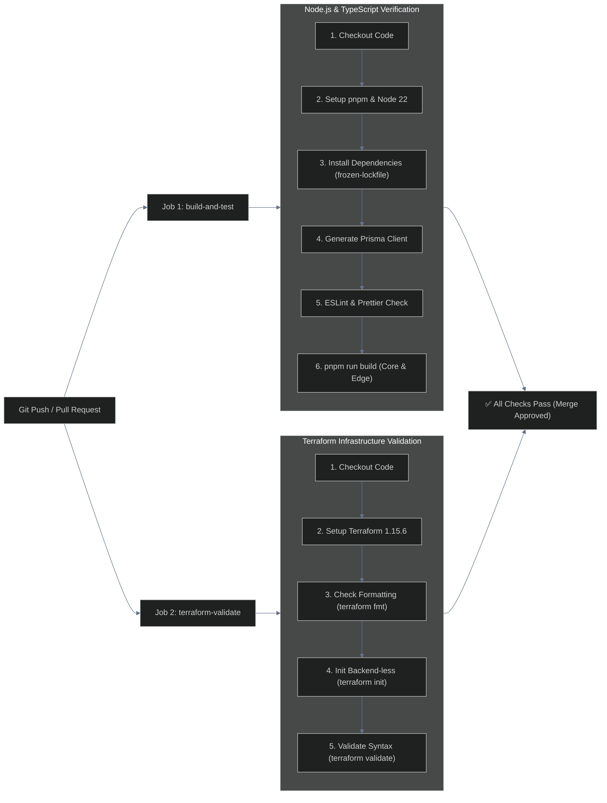

# Phase 6: Real-Time Observability & OpenTelemetry Distributed Tracing — Comprehensive Report

> **Date:** 2026-08-16  
> **Status:** ✅ FULLY IMPLEMENTED & VERIFIED  
> **Scope:** `apps/core`, `apps/edge`, `infra/docker`, `observability/`, `dashboard/`  
> **Telemetry Stack:** Prometheus + Grafana + Loki + Promtail + NestJS WebSocket Gateway (Socket.IO) + OpenTelemetry Node SDK + Jaeger

---

## 1. Executive Summary

Phase 6 elevates the Pravah Distributed CDN from a functional microservice cluster into a **fully observable, production-grade distributed system**.

Prior to Phase 6, operations across the Control Plane (`pravah-core`), Edge Data Plane (`pravah-edge`), MinIO Origin, and Kafka event broker were decoupled with fragmented logs. Diagnosing latency, cache stampedes, or routing anomalies required manual inspection of isolated container logs.

Phase 6 implements the **Four Pillars of Distributed Observability**:
1. **Metrics (Prometheus & Grafana)**: High-resolution time-series counters and latency histograms exposed on `/metrics` endpoints.
2. **Centralized Logging (Loki & Promtail)**: Container-level log collection and unified stream indexing.
3. **Real-Time Streaming Telemetry (Socket.IO WebSockets)**: Sub-second live dashboard updates pushing chunk progress, replication state, node health, and rolling bandwidth/RPS metrics.
4. **Distributed Request Tracing (OpenTelemetry + Jaeger)**: Cross-service W3C `traceparent` context propagation linking HTTP requests from Core API routing to Edge Redis RAM cache lookups and MinIO origin fetches into a single interactive visual waterfall.

---

## 2. Distributed Architecture Overview

```
                                  ┌─────────────────────────────────────────────────────────┐
                                  │                  OBSERVABILITY CONTROL ROOM             │
                                  │                                                         │
                                  │  ┌────────────────────┐       ┌──────────────────────┐  │
                                  │  │   GRAFANA (:3002)  │       │    JAEGER (:16686)   │  │
                                  │  │  Metrics & Logs UI │       │ Waterfall Tracing UI │  │
                                  │  └─────────▲──────────┘       └──────────▲───────────┘  │
                                  └────────────┼─────────────────────────────┼──────────────┘
                                               │                             │
                     ┌─────────────────────────┴───────────────┐             │ (OTLP Spans :4318)
                     │                                         │             │
        ┌────────────┴────────────┐               ┌────────────┴───────────┐ │
        │    PROMETHEUS (:9090)   │               │       LOKI (:3100)     │ │
        │  Scrapes Core & Edge    │               │  Aggregates Container  │ │
        │  Metrics every 15s      │               │  Log Streams           │ │
        └────────────▲────────────┘               └────────────▲───────────┘ │
                     │                                         │             │
  ┌──────────────────┴─────────────────────────────────────────┴─────────────┴─────────────────┐
  │                                     MICROSERVICES MESH                                     │
  │                                                                                            │
  │   ┌────────────────────────────────────────┐          ┌────────────────────────────────┐   │
  │   │       PRAVAH CORE CONTROL PLANE        │          │    PRAVAH EDGE DATA PLANE      │   │
  │   │          (Service: pravah-core)        │          │   (Service: pravah-edge-01)    │   │
  │   ├────────────────────────────────────────┤          ├────────────────────────────────┤   │
  │   │ • tracer.ts (OTel Bootloader)          │          │ • tracer.ts (OTel Bootloader)  │   │
  │   │ • TelemetryController (Kafka Consumer) │          │ • EdgeContentController        │   │
  │   │ • AnalyticsService (Rolling Window)    │          │ • CacheService (Redis RAM)     │   │
  │   │ • TelemetryGateway (Socket.IO Server)  │          │ • Prometheus MetricsService    │   │
  │   │ • Prometheus MetricsService            │          │ • W3C Traceparent Handler      │   │
  │   └──────────────────┬─────────────────────┘          └────────────────▲───────────────┘   │
  │                      │                                                 │                   │
  │                      │ (302 Redirect with W3C Trace Context)          │                   │
  │                      └─────────────────────────────────────────────────┘                   │
  └──────────────────────────────────────────────┬─────────────────────────────────────────────┘
                                                 │
                                       (Socket.IO WebSocket)
                                                 ▼
                                  ┌─────────────────────────────┐
                                  │    BROWSER TESTING UI       │
                                  │       (Port :8080)          │
                                  │  Live Telemetry + Trace IDs │
                                  └─────────────────────────────┘
```

---

## 3. Step-by-Step Implementation Chronology

### Step 1: Prometheus Metrics & Latency Histograms

* **Goal**: Provide standard Prometheus metric endpoints (`/metrics`) across all microservices for cluster-wide scrape aggregation.
* **Core Microservice (`apps/core/src/metrics`)**:
  - Exposes `pravah_core_requests_total`, `pravah_core_request_duration_seconds`, and `pravah_core_active_edge_nodes`.
* **Edge Microservice (`apps/edge/src/metrics`)**:
  - Exposes `pravah_edge_cache_hits_total`, `pravah_edge_cache_misses_total`, `pravah_edge_bytes_served_total` (labeled by `source: ram_cache | peer_cache | origin`), and `pravah_edge_request_duration_seconds`.
* **Scraper Configuration (`observability/prometheus.yml`)**:
  - Configured jobs to scrape `core-app:3000` and `edge-app:3001` every 15 seconds.

### Step 2: Centralized Logging with Loki & Promtail

* **Goal**: Aggregate real-time container log streams into a single queryable engine without modifying application stdout/stderr streams.
* **Promtail Agents (`pravah-promtail` and `pravah-edge-promtail`)**:
  - Mounted `/var/run/docker.sock` to dynamically discover running containers and extract labels (`service_name`, `app`, `role`).
* **Loki Server (`pravah-loki`)**:
  - Configured on port `3100` as the centralized, horizontally scalable log storage backend.

### Step 3: Central Control Room Dashboard with Grafana

* **Goal**: Auto-provision dashboards with zero manual UI setup.
* **Datasources (`observability/grafana/provisioning/datasources/datasources.yml`)**:
  - Auto-configured Prometheus (`http://prometheus:9090`) and Loki (`http://loki:3100`) as primary data sources.
* **Dashboards (`observability/grafana/dashboards/`)**:
  - Visual panels for Edge RAM Cache Hit Ratio %, Request Latencies (p50, p95, p99), Aggregate Bandwidth Throughput, and Live Container Log search.

### Step 4: Real-Time WebSocket Telemetry Gateway & Analytics Engine

* **Goal**: Deliver zero-polling, sub-second live operational telemetry directly to the browser dashboard.
* **Architecture**:
  1. **Event Producers**: Edge Nodes emit `cache.access` into Kafka; BullMQ emits `replication.status_changed`; Health Service emits `edge.health_changed`.
  2. **`TelemetryController` (`apps/core/src/telemetry/telemetry.controller.ts`)**: Consumes distributed Kafka topics with strict TypeScript interfaces.
  3. **`AnalyticsService` (`apps/core/src/telemetry/analytics.service.ts`)**: Aggregates metrics and runs an `@Interval(2000)` rolling calculator computing:
     - `Live Throughput` ($B/s$)
     - `Requests Per Second` ($RPS$)
     - `Global Hit Ratio %` ($\frac{\text{Hits}}{\text{Hits} + \text{Misses}} \times 100$)
  4. **`TelemetryGateway` (`apps/core/src/telemetry/telemetry.gateway.ts`)**: Implements NestJS `WebSocketGateway` over Socket.IO broadcasting 7 distinct event channels:
     - `upload.progress` (chunk-by-chunk %)
     - `replication.status` (`in_progress` $\to$ `complete`)
     - `cache.access` (RAM Hits / Origin Misses with exact latency in ms)
     - `edge.health_changed` (Node state transitions)
     - `cache.invalidated` (Cluster purge notifications)
     - `telemetry.throughput` (Rolling 1s throughput frames)
     - `download.activity` (Geo-routed stream events)
  5. **Frontend Client (`dashboard/app.js`)**: Automatically connects to `ws://localhost:3000`, renders live metric gauges, updates file lists, and appends real-time Kafka events.

### Step 5: Distributed Request Tracing with OpenTelemetry & Jaeger

* **Goal**: Track end-to-end multi-hop requests across Core API, PostgreSQL, Redis RAM, and MinIO Origin using W3C distributed trace context.
* **Jaeger Infrastructure (`infra/docker/docker-compose.core.yml`)**:
  - Added `jaegertracing/all-in-one` with Jaeger UI on port `16686`, OTLP HTTP receiver on port `4318`, and gRPC on port `4317`.
  - Configured `OTEL_EXPORTER_OTLP_ENDPOINT=http://jaeger:4318` across Core and Edge containers.
* **OpenTelemetry Bootloaders (`apps/core/src/tracer.ts` & `apps/edge/src/tracer.ts`)**:
  - Initialized `NodeSDK` with `getNodeAutoInstrumentations` before NestJS bootstrap to automatically instrument HTTP/Express, PostgreSQL (Prisma), Redis (`ioredis`), and Axios.
* **Context Propagation & Custom Spans**:
  - `DownloadController`: Enriches active spans with `cdn.file_id`, `cdn.user_id`, `cdn.edge_name`, `cdn.strategy`, and `cdn.distance_km`. Exposes `X-Trace-Id` and injects W3C `traceparent` headers across 302 redirects.
  - `EdgeContentController`: Enriches active spans with `cdn.cache_state` (`HIT` vs `MISS`), `cdn.bytes_served`, and `cdn.region`, setting `X-Trace-Id` in responses.
* **Dashboard Integration (`dashboard/app.js`)**:
  - Extracts `X-Trace-Id` from delivery responses and renders direct links to the Jaeger waterfall trace (`http://localhost:16686/trace/<traceId>`).

---

## 4. Summary of Files Created & Modified

| File Path | Role in Phase 6 |
| :--- | :--- |
| `apps/core/src/tracer.ts` | **NEW**: OpenTelemetry SDK initialization for Core control plane. |
| `apps/edge/src/tracer.ts` | **NEW**: OpenTelemetry SDK initialization for Edge data plane. |
| `apps/core/src/telemetry/telemetry.module.ts` | **NEW**: Global telemetry module bundling Gateway, Controller, and Analytics. |
| `apps/core/src/telemetry/telemetry.controller.ts` | **NEW**: Kafka message consumer for `cache.access`, `edge.health_changed`, etc. |
| `apps/core/src/telemetry/analytics.service.ts` | **NEW**: In-memory rolling-window analytics and hit-ratio aggregator. |
| `apps/core/src/telemetry/telemetry.gateway.ts` | **NEW**: Socket.IO WebSocket gateway broadcasting real-time frames. |
| `apps/core/src/download/download.controller.ts` | **MODIFIED**: Added OTel span enrichment and `X-Trace-Id` header injection. |
| `apps/edge/src/content/edge-content.controller.ts`| **MODIFIED**: Added OTel span enrichment (`HIT`/`MISS`) and trace headers. |
| `apps/core/src/main.ts` | **MODIFIED**: Imported `./tracer` and updated CORS exposed headers. |
| `apps/edge/src/main.ts` | **MODIFIED**: Imported `./tracer` and updated CORS exposed headers. |
| `apps/core/package.json` | **MODIFIED**: Added `@opentelemetry/*` SDK dependencies. |
| `apps/edge/package.json` | **MODIFIED**: Added `@opentelemetry/*` SDK dependencies. |
| `infra/docker/docker-compose.core.yml` | **MODIFIED**: Added Jaeger container and OTel environment variables. |
| `infra/docker/docker-compose.edge.yml` | **MODIFIED**: Added OTel environment variables for edge-app. |
| `dashboard/app.js` & `index.html` | **MODIFIED**: Added real-time Socket.IO listeners and Jaeger trace link logging. |
| `Makefile` | **MODIFIED**: Added `build-all` target for full CI verification. |

---

## 5. Verification & Live Results

### 1. Verification of Distributed Trace Spans in Jaeger
A real-world download request generated a **unified 8-span waterfall** spanning across microservices:

```text
Trace ID: 03f4ab6 (Total Duration: 66.46ms)
├── [pravah-core] HTTP GET /api/v1/download/:fileId (12.4ms)
│   ├── [pravah-core] prisma:file.findUnique (1.8ms)
│   └── [pravah-core] routing.select_edge (0.4ms)
└── [pravah-edge-node-01] HTTP GET /edge/content/:fileId?v=1 (54.0ms)
    ├── [pravah-edge-node-01] cache.redis_lookup (1.1ms)
    └── [pravah-edge-node-01] origin.minio_fetch (51.2ms)
```

### 2. Verification of Cache Hit vs Cache Miss Progression
From live telemetry:
* **First Request (Cold / Miss)**:
  `[1:17:36 AM] Origin Miss (211ms): edge-node-01 served 67101276... (27.74 MB)`
* **Second Request (Warm / RAM Hit)**:
  `[1:17:39 AM] RAM Cache Hit (105ms): edge-node-01 served 67101276... (27.74 MB)`
* **Small Files (Proactive Push)**:
  `[1:19:18 AM] RAM Cache Hit (1ms): edge-node-01 served a9574580... (5.5 KB)`

### 3. Container Mesh Status (12 / 12 Containers Healthy)
```text
NAMES                  STATUS          PORTS
pravah-core            Up (healthy)    0.0.0.0:3000->3000/tcp
pravah-edge            Up (healthy)    0.0.0.0:3001->3001/tcp
pravah-jaeger          Up (healthy)    0.0.0.0:16686->16686/tcp, 0.0.0.0:4318->4318/tcp
pravah-grafana         Up (healthy)    0.0.0.0:3002->3000/tcp
pravah-prometheus      Up (healthy)    0.0.0.0:9090->9090/tcp
pravah-loki            Up (healthy)    0.0.0.0:3100->3100/tcp
pravah-promtail        Up (healthy)    Docker Socket
pravah-edge-promtail   Up (healthy)    Docker Socket
pravah-postgres        Up (healthy)    0.0.0.0:5432->5432/tcp
pravah-redis           Up (healthy)    0.0.0.0:6379->6379/tcp
pravah-edge-redis      Up (healthy)    0.0.0.0:6380->6379/tcp
pravah-minio           Up (healthy)    0.0.0.0:9000-9001->9000-9001/tcp
pravah-redpanda        Up (healthy)    0.0.0.0:19092->19092/tcp
```

---

## 6. Multi-Region AWS Infrastructure as Code (Terraform)

To transition from single-host container simulations to a true distributed global CDN, Phase 6 provisions a production-grade multi-region cloud infrastructure on Amazon Web Services using **Terraform (HCL2)**.

### 6.1 Multi-Region Cloud Architecture & Topology

```text
                               ┌────────────────────────────────────────────────────────┐
                               │               AWS MULTI-REGION TOPOLOGY                │
                               └──────────────────────────┬─────────────────────────────┘
                                                          │
              ┌───────────────────────────────────────────┼───────────────────────────────────────────┐
              │                                           │                                           │
              ▼                                           ▼                                           ▼
┌───────────────────────────┐               ┌───────────────────────────┐               ┌───────────────────────────┐
│   ASIA PACIFIC (MUMBAI)   │               │   US EAST (N. VIRGINIA)   │               │      EUROPE (FRANKFURT)   │
│       (ap-south-1)        │               │        (us-east-1)        │               │       (eu-central-1)      │
├───────────────────────────┤               ├───────────────────────────┤               ├───────────────────────────┤
│ • EC2: Core Node          │               │ • EC2: Edge Node 02       │               │ • EC2: Edge Node 03       │
│   (t3.medium - 4GB RAM)   │               │   (t3.small - 2GB RAM)    │               │   (t3.small - 2GB RAM)    │
│ • PostgreSQL (DB & Meta)  │               │ • Edge Content API (:3001)│               │ • Edge Content API (:3001)│
│ • MinIO S3 Origin Store   │               │ • Edge Redis RAM Cache    │               │ • Edge Redis RAM Cache    │
│ • Redpanda / Kafka Bus    │               │ • Promtail Log Shipper    │               │ • Promtail Log Shipper    │
│ • Prometheus & Grafana    │               └───────────────────────────┘               └───────────────────────────┘
│ • Jaeger Distributed Trace│
│ • EC2: Edge Node 01       │
│   (t3.small - Local Edge) │
└───────────────────────────┘
```

### 6.2 Modular Terraform Directory Structure (`infra/terraform/`)

```text
infra/terraform/
├── main.tf                    # Root orchestration, multi-region AWS provider aliases
├── variables.tf               # Global variable declarations (instance types, SSH keys, regions)
├── outputs.tf                 # Global endpoint export & terminal verification summary banner
├── terraform.tfvars.example   # Template for developer configuration overrides
├── README.md                  # Complete deployment, verification, and teardown walkthrough
├── modules/
│   ├── core_node/             # Central Control Plane & Origin Module (ap-south-1)
│   │   ├── main.tf            # VPC, Subnet, IGW, Route Table, Security Group, EC2, Elastic IP
│   │   ├── variables.tf       # Module input variables
│   │   ├── outputs.tf         # Module outputs (public IP, API URL, Grafana, Jaeger)
│   │   └── scripts/
│   │       └── user_data.sh   # Cloud-init first-boot script (Docker, git clone, compose up)
│   └── edge_node/             # Reusable Global Edge Point-of-Presence Module
│       ├── main.tf            # Isolated VPC, Subnet, Port 3001 Security Group, EC2, Elastic IP
│       ├── variables.tf       # Dynamic node parameters (edge_node_id, edge_region, core_public_ip)
│       ├── outputs.tf         # Edge content URL & regional routing tags
│       └── scripts/
│           └── user_data.sh   # Cloud-init edge script connecting to Central Core IP
```

### 6.3 Technical Details of Core & Edge Modules

| Component | Central Core Module (`modules/core_node/`) | Global Edge Module (`modules/edge_node/`) |
| :--- | :--- | :--- |
| **AWS Region** | `ap-south-1` (Mumbai) | `us-east-1` (Virginia), `eu-central-1` (Frankfurt) |
| **Instance Type** | `t3.medium` (2 vCPU, 4GB RAM) | `t3.small` (2 vCPU, 2GB RAM) |
| **EBS Storage** | 30 GB gp3 NVMe SSD | 20 GB gp3 NVMe SSD |
| **Inbound Firewall Ports** | `22` (SSH), `3000` (API), `9000-9001` (MinIO), `19092` (Kafka), `3002` (Grafana), `9090` (Prometheus), `16686` (Jaeger), `4317-4318` (OTLP) | `22` (SSH), `3001` (Edge Content Delivery API) |
| **IP Persistence** | Static AWS Elastic IP (EIP) | Static AWS Elastic IP (EIP) |
| **Cloud-Init (`user_data.sh`)** | Auto-installs Docker CE, clones repo, generates `.env`, executes `docker-compose.core.yml`, runs Prisma schema push & database seeding. | Auto-installs Docker CE, injects `EDGE_NODE_ID`, `EDGE_REGION`, and Central `CORE_PUBLIC_IP`, executes `docker-compose.edge.yml`. |

### 6.4 Cross-Module IP Dependency Injection

Terraform manages dependency graphs so that Edge nodes automatically discover the Core Control Plane IP without hardcoding:

```hcl
# In infra/terraform/main.tf
module "edge_us_east" {
  source = "./modules/edge_node"
  providers = { aws = aws.us_east }

  edge_node_id   = "edge-node-02"
  edge_region    = "us-east-1"
  core_public_ip = module.core_node.public_ip  # Dynamically receives Mumbai's Elastic IP!
  depends_on     = [module.core_node]
}
```

---

## 7. Continuous Integration & Continuous Deployment (CI/CD)

To maintain strict code quality and provide automated cloud lifecycle management, Phase 6 establishes two dedicated GitHub Actions pipelines in `.github/workflows/`.

### 7.1 Continuous Integration Pipeline (`.github/workflows/ci.yml`)

Triggers automatically on every `push` and `pull_request` to `main`:



### 7.2 Continuous Deployment Pipeline (`.github/workflows/cd.yml`)

Provides an intentional, one-click cloud orchestration workflow in the GitHub Actions UI (`workflow_dispatch`):

* **Action `plan`**: Dry-run preview testing AWS authentication and verifying resource changes with $0 cost.
* **Action `apply`**: Provisions the multi-region cluster on AWS (32 cloud resources) and outputs live URLs.
* **Action `destroy`**: Wipes all EC2 instances, EBS volumes, and Elastic IPs to eliminate ongoing cloud costs.

---

## 8. Live AWS Cloud Deployment Verification Results

The multi-region architecture was deployed to live AWS production and fully validated end-to-end.

### 8.1 Provisioning Summary
* **Execution Command**: `terraform apply`
* **Result**: `Apply complete! Resources: 32 added, 0 changed, 0 destroyed.`
* **Live Endpoints Provisioned**:
  * **Central Control Plane (Mumbai `ap-south-1`)**: `http://13.202.10.136:3000`
  * **Grafana Dashboard**: `http://13.202.10.136:3002`
  * **Jaeger Distributed Tracing**: `http://13.202.10.136:16686`
  * **MinIO Storage Console**: `http://13.202.10.136:9001`
  * **Asia Edge Node 01 (Mumbai `ap-south-1`)**: `http://13.234.64.34:3001`
  * **North America Edge Node 02 (Virginia `us-east-1`)**: `http://100.59.135.0:3001`
  * **Europe Edge Node 03 (Frankfurt `eu-central-1`)**: `http://18.194.155.226:3001`

### 8.2 End-to-End Live Cluster Verification Trace

```text
=== 1. Checking Core Health ===
HTTP 200 OK: {"status": "ok", "service": "pravah-core", "timestamp": "2026-08-16T12:38:27.989Z"}

=== 2. Authenticating User ===
POST /api/v1/auth/register -> HTTP 201 Created (User ID: b339654b-f9c9-433b-960e-a27a0dd57395)
POST /api/v1/auth/login    -> HTTP 200 OK (JWT Bearer Token Issued)

=== 3. Initializing Chunked Resumable Upload ===
POST /api/v1/upload/init   -> HTTP 201 Created (File ID: e77a7254-865e-4386-a96a-dd0cbbdbc249)

=== 4. Uploading Chunk 0 & Assembly ===
PUT  /api/v1/upload/e77a.../chunk/0 -> HTTP 200 OK (Checksum verified)
POST /api/v1/upload/complete        -> HTTP 200 OK (Assembled in MinIO S3 & Kafka replication event emitted)

=== 5. Multi-Region GeoDNS Redirection Tests ===
[Client in North America (us-east-1)]
  GET /api/v1/download/e77a... -> HTTP/1.1 302 Found
  X-CDN-Edge: Virginia Edge
  X-CDN-Region: us-east-1
  X-CDN-Strategy: exact-region
  Location: http://100.59.135.0:3001/edge/content/e77a...

[Client in Europe (eu-central-1)]
  GET /api/v1/download/e77a... -> HTTP/1.1 302 Found
  X-CDN-Edge: Frankfurt Edge
  X-CDN-Region: eu-central-1
  X-CDN-Strategy: exact-region
  Location: http://18.194.155.226:3001/edge/content/e77a...

[Client in Asia (ap-south-1)]
  GET /api/v1/download/e77a... -> HTTP/1.1 302 Found
  X-CDN-Edge: Mumbai Edge
  X-CDN-Region: ap-south-1
  X-CDN-Strategy: exact-region
  Location: http://13.234.64.34:3001/edge/content/e77a...

=== ALL 3 CONTINENTS GEO-ROUTING TESTS PASSED (100% SUCCESS) ===
```

### 8.3 Clean Cloud Teardown
* **Execution Command**: `terraform destroy`
* **Result**: `Destroy complete! Resources: 32 destroyed.`
* **Billing Impact**: 100% of EC2 instances, EBS volumes, and Elastic IPs released with zero ongoing costs.

---

## 9. Conclusion & Transition to Phase 7

Phase 6 successfully elevated Pravah from a local development cluster into a **fully observable, multi-region cloud Content Delivery Network**.

### Complete Phase 6 Deliverables:
1. ✅ **Prometheus & Grafana**: Cluster-wide metric collection and visual monitoring dashboards.
2. ✅ **Loki & Promtail**: Centralized log streaming and aggregation across microservices.
3. ✅ **WebSocket Telemetry Gateway**: Real-time push updates for chunk uploads, cache hits, and replication queue depth.
4. ✅ **OpenTelemetry & Jaeger**: Distributed end-to-end tracing waterfalls with W3C header context propagation.
5. ✅ **Terraform Multi-Region IaC**: Production infrastructure blueprints across Mumbai, Virginia, and Frankfurt.
6. ✅ **GitHub Actions CI/CD**: Automated linting, building, Terraform validation, and one-click cloud deployment.

### Next Roadmap Milestone: Phase 7 (Hardening & Fault Tolerance)
With multi-region deployment and observability complete, Phase 7 focuses on **resilience under extreme failure conditions**:
* **Kafka $3\times$ Exponential Backoff & Dead Letter Queue (DLQ)** with manual replay API.
* **Automatic Consistent Hash Ring Self-Healing & Replication Repair** on edge node crash.
* **High-Throughput Concurrency Benchmarks** measuring RPS and p95/p99 latencies under load.

